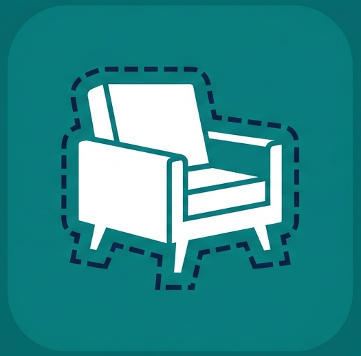
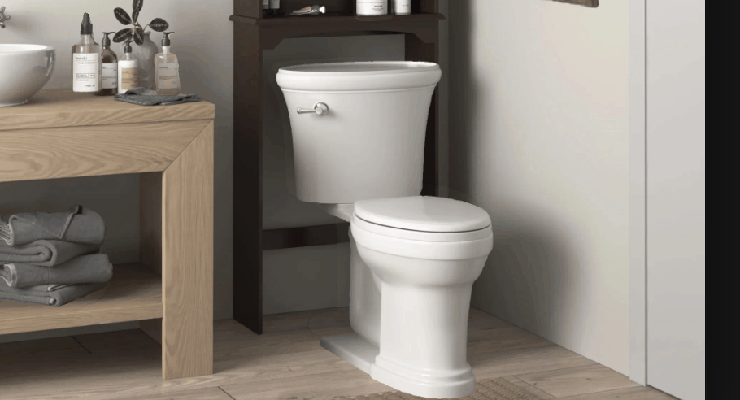
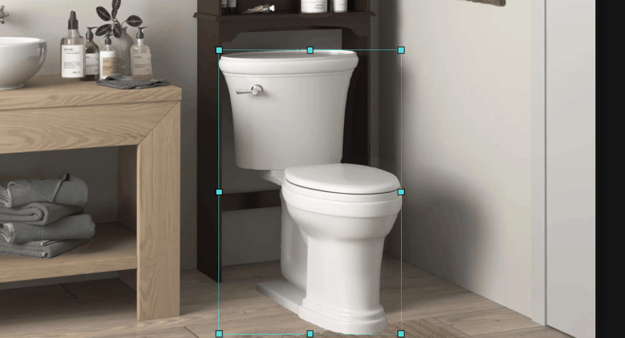
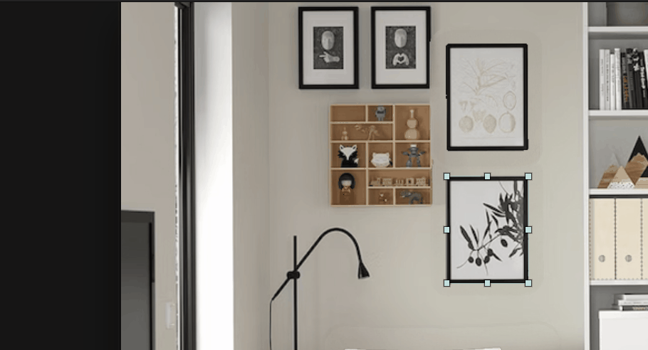
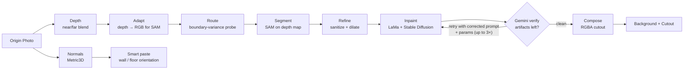
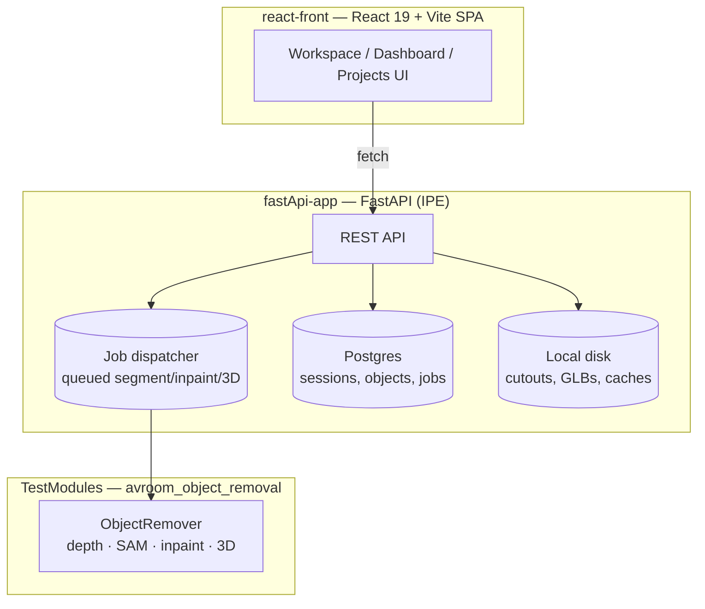

<div align="center">



# AVRoom

**Upload a room photo. Click a chair. It's gone — and now you can move it.**


</div>

AVRoom is an AI-driven interior design workspace. Point at furniture in a photo, and it's
segmented out and the background is inpainted as if it was never there. The removed object
survives as a draggable cutout you can reposition, rotate, and copy — all in the browser.

## Demo

<!-- docs/media/drag-drop.gif -->


<!-- docs/media/rotation.gif -->


<!-- docs/media/smart-paste.gif -->


## What it does

- **Object removal** — click an object, pick from candidate masks (or let it guess and pick the best one), and the object is
  cut out while the background is inpainted around the hole.
- **Erase** — draw a freehand lasso around anything the click-and-segment flow can't grab, and it's
  removed and the background filled the same way — no cutout kept.
- **Drag & drop** — reposition any cutout on the canvas.
- **Smart paste** — drop an object anywhere and it rescales to the local depth, optionally
  matching the room's perspective as it moves.
- **2D rotation via novel-view synthesis** — a 3D model is generated from the cutout;
  rotate it and commit an angle to get a freshly rendered 2D view in place.
- **Copy / delete** objects, each tracked independently per room.
- **Projects → Rooms** — rooms are grouped under projects, each with its own preview thumbnail.
- **Export / import** — a project or a single room packs down to a self-contained zip and
  restores on any instance under the caller's account.
- **Batch actions** — arm several operations at once (erase, cut out, cut out + 3D, generate 3D)
  from clicks, boxes, lassos, or existing objects, approve the queue, and collect every result
  when the whole batch lands.
- **Email on completion** — the long jobs (inpainting, 3D generation) email you when they finish,
  so you don't sit and watch a spinner.

## How it works



Three rules the pipeline never breaks:

- **SAM sees the depth map, not the RGB photo.** RGB over-segments on fabric creases and shadows.
- **Stable Diffusion refines a native-resolution crop, never the full image** — avoids
  the hallucinations and reimagining of the full room Stable diffusion would otherwise perform.
- **Inpainting is checked, not trusted.** LaMa fills the hole, Stable Diffusion refines the
  texture, then Gemini looks at a before/after crop and decides whether any ghost of the object
  survived. If it did, it hands back a corrected prompt and generation parameters and the pass
  runs again — up to three retries before the last candidate is kept.

Smart paste rides on a second model: **Metric3D** produces a surface-normal map of the room, so
when an object is dropped it knows which way the wall or floor under it faces and can turn to
match, not just rescale.

## Architecture



The AI pipeline is imported in-process (`pip install -e ./TestModules`), not a separate service.
Metadata (sessions, objects, jobs) lives in Postgres; blob artifacts (cutout PNGs, GLBs, novel-view
caches) stay on local disk.

## Quick start

```bash
# 1. Start Postgres + Mailpit
docker compose up -d --wait db mailpit

# 2. Python deps (repo root)
python -m venv .venv && .venv\Scripts\activate   # or source .venv/bin/activate
pip install -r requirements.txt

# 3. Apply DB schema
cd fastApi-app
alembic upgrade head

# 4. Run backend + frontend
uvicorn main:app --reload                 # http://127.0.0.1:8000
cd ../react-front && npm install && npm run dev   # http://localhost:5173
```

Windows: `run.bat` does all of the above in one shot (Postgres/Mailpit → migrations → both dev
servers, each in its own terminal).

| Service | Port |
|---|---|
| FastAPI | 8000 |
| Vite dev server | 5173 |
| Mailpit (email preview) | 8025 |
| Postgres | 5433 (not 5432 — see `fastApi-app/.env.example`) |

## Configuration

Copy `fastApi-app/.env.example` to `fastApi-app/.env`. Everything has a sane local default; the
knobs that matter most:

| Var | Purpose |
|---|---|
| `HF_TOKEN` | Hugging Face token — required for 3D reconstruction (Hunyuan3D-2.1 Space) |
| `GEMINI_API_KEY` | Key for the inpaint verification pass (restrict it to `generativelanguage.googleapis.com`) |
| `INFERENCE_WORKERS` | `0` = inline with a process GPU lock, `N` = N parallel inference workers |
| `VALIDATE` | Gate upload validation (technical + content checks); `false` to skip |
| `AUTH_MODE` | `single_user` (default, no login) or `jwt` (real accounts) |
| `DATABASE_URL` | Defaults to the docker-compose Postgres on `localhost:5433` |

## Repo layout

```
avroom/
├── TestModules/    # AI pipeline (avroom_object_removal): depth, segmentation, inpainting, 3D
├── fastApi-app/    # FastAPI backend — API routes, job dispatcher, Postgres models
└── react-front/    # React + TypeScript frontend
```

## Team

[@1mache](https://github.com/1mache) · [@EitanVeryKatz](https://github.com/EitanVeryKatz)
