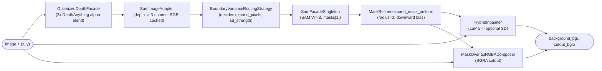

# AI Pipeline Docs

The AI pipeline is the Python package `avroom_object_removal`, with sources in [`TestModules/src/`](../../TestModules/src/). It does the actual depth → segmentation → inpainting work; the FastAPI backend is just a thin wrapper around it.

## Public surface

```1:3:TestModules/src/__init__.py
from .core.objectRemover import ObjectRemover

__all__ = ["ObjectRemover"]
```

One class, one method that matters: `ObjectRemover.remove_object(image_path, x, y, image_bytes=None)`.

## Pages

- [overview.md](overview.md) — package layout, install, public surface.
- [object-remover.md](object-remover.md) — the orchestrator and the 8 pipeline stages.
- [depth.md](depth.md) — the two-model alpha-blended depth facade.
- [segmentation.md](segmentation.md) — SAM facade and the depth-to-RGB adapter.
- [routing.md](routing.md) — the strategy that picks SAM input + expansion + SD strength.
- [inpainting.md](inpainting.md) — LaMa, Stable Diffusion, and the hybrid composition.
- [utils.md](utils.md) — `MaskRefiner`, `MaskOverlapRGBAComposer`, `DebugImageSaver`, `ImageAdapterFactory`.
- [tests.md](tests.md) — the integration scripts under `TestModules/tests/`.
- [outputs.md](outputs.md) — every debug PNG produced per call.
- [3d-reconstruction-hunyuan.md](3d-reconstruction-hunyuan.md) — Hunyuan3D-2.1 stub; not wired in.
- [data-flow.md](data-flow.md) — line-by-line trace through `remove_object`.

## At a glance


