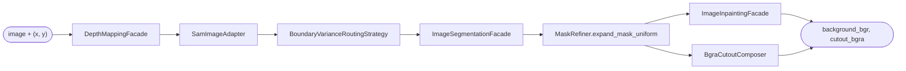

# AI Pipeline Docs

The pipeline is the Python package `avroom_object_removal` ([`TestModules/src/`](../../TestModules/src/)). Its main job is **click-based object removal** in one pass over the image.

**At a glance:** `image → depth → adapt → route → segment → refine mask → inpaint → BGRA cutout`  
FastAPI only loads bytes and calls `ObjectRemover.remove_object`; it does not embed model logic.

## How these docs are organized

Overviews live in each folder’s `README.md`. Deeper detail is split into small files (`components.md`, `flow.md`, `contracts.md`, `operations.md`) so you can read one concern at a time. See [overview-vs-partials.md](overview-vs-partials.md).

## Where to read

- [core/README.md](core/README.md) — orchestrator and end-to-end stage list
- [ai-engines/README.md](ai-engines/README.md) — depth, segmentation, inpainting, optional 3D
- [routing/README.md](routing/README.md) — how a click chooses SAM/SD parameters
- [utils/README.md](utils/README.md) — mask helpers, cutout compose, debug saver
- [tests/README.md](tests/README.md) — manual scripts and smoke tests

## Runtime status

- **On the click API path:** core, depth, segmentation, routing, inpainting, utils.
- **In the package but not on the click API path:** 3D reconstruction (OpenLRM by default; Trellis when injected), used from tests only.

## Public surface

- Main entry: `ObjectRemover.remove_object(...)`.
- Domain facades (`DepthMappingFacade`, `ImageSegmentationFacade`, `ImageInpaintingFacade`, `Reconstruction3DFacade`) hide strategy implementations.
- Heavy models load once per process behind `functools.lru_cache` factories inside strategies.

## Diagram

