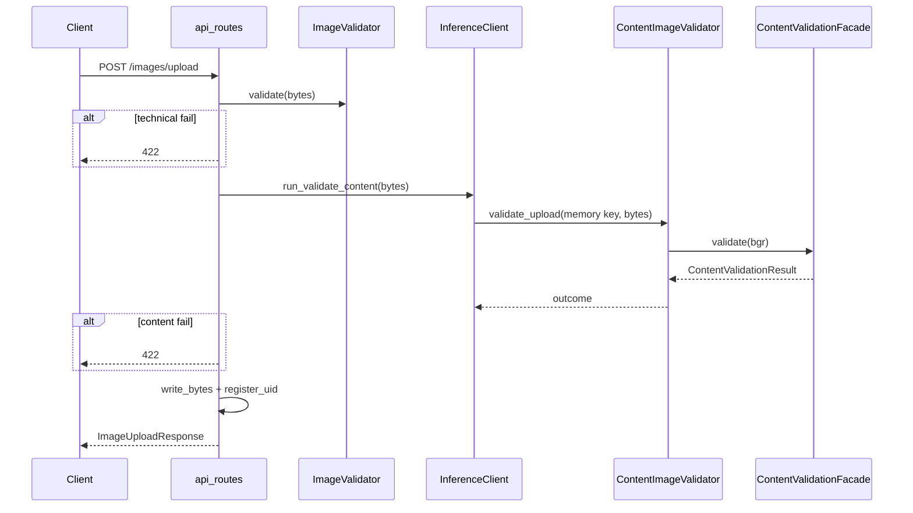

# Content validation flow

## Upload gate (end-to-end)

## CLIP strategy steps

1. Convert BGR input to RGB PIL image.
2. Run seven 2-label CLIP softmax contests (concept vs concrete room/space) via `openai/clip-vit-base-patch32` (lazy-loaded on first `score_labels` / `validate`).
3. Derive seven named checks from each contest's `P(concept)` (see [contracts.md](contracts.md)).
4. Aggregate pass/fail and human-readable rejection messages.

## Composite strategy

Runs each child strategy in order, merges `checks`/`scores`/`messages`, sets `is_valid = all(checks.values())`.

## Auto cutout pick (core, not the facade)

When `POST /images/segment` is called with `verify=auto`, [`select_best_cutout`](../../../../TestModules/src/core/cutout_selector.py) runs after `ObjectSegmentor`:

1. Pre-filter: click must hit cutout alpha; mask area between 0.3% and 70% of the image.
2. Crop BGRA to alpha bbox and composite on mid-gray.
3. `binary_prob` vs complete-object vs partial/wall/blob labels.
4. Winner = max `P(good)` if `>= 0.6`, else no winner → HTTP 422 `no viable mask`.
