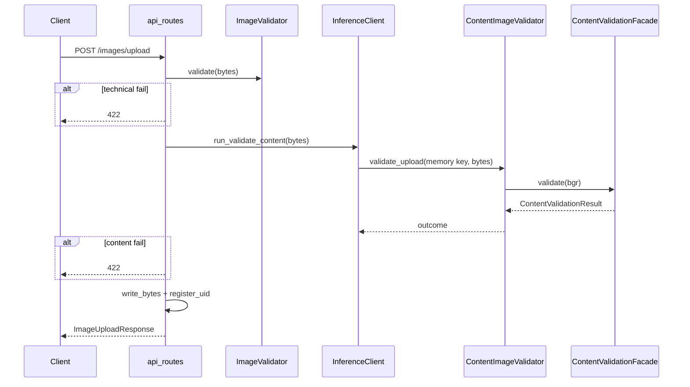

# Content validation flow

## Upload gate (end-to-end)

## CLIP strategy steps

1. Convert BGR input to RGB PIL image.
2. Score label groups via CLIP (`openai/clip-vit-base-patch32`, lazy-loaded).
3. Derive seven named checks (see [contracts.md](contracts.md)).
4. Aggregate pass/fail and human-readable rejection messages.

## Composite strategy

Runs each child strategy in order, merges `checks`/`scores`/`messages`, sets `is_valid = all(checks.values())`.
