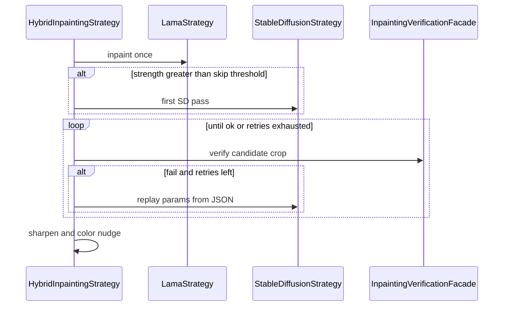

# Inpainting verification flow

Default: pad-crop the mask, send crop + current params to Gemini. Pass copies input knobs. Fail returns rewritten knobs. Placeholder `GEMINI_API_KEY` (or HTTP/JSON failure) uses CLIP labels instead (`photorealistic room` wins). Exhausted retries keep the last candidate.
