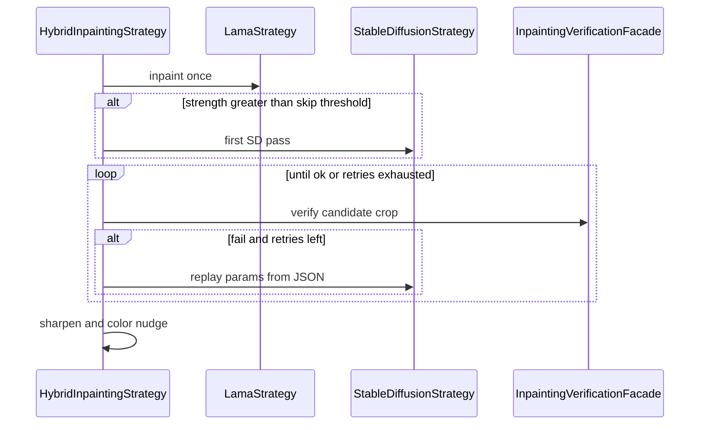

# Inpainting verification flow

CLIP v1: pad-crop the mask, score labels, pass if `photorealistic room` wins. On fail, JSON is the params that were used (no invented knobs). Exhausted retries keep the last candidate.
