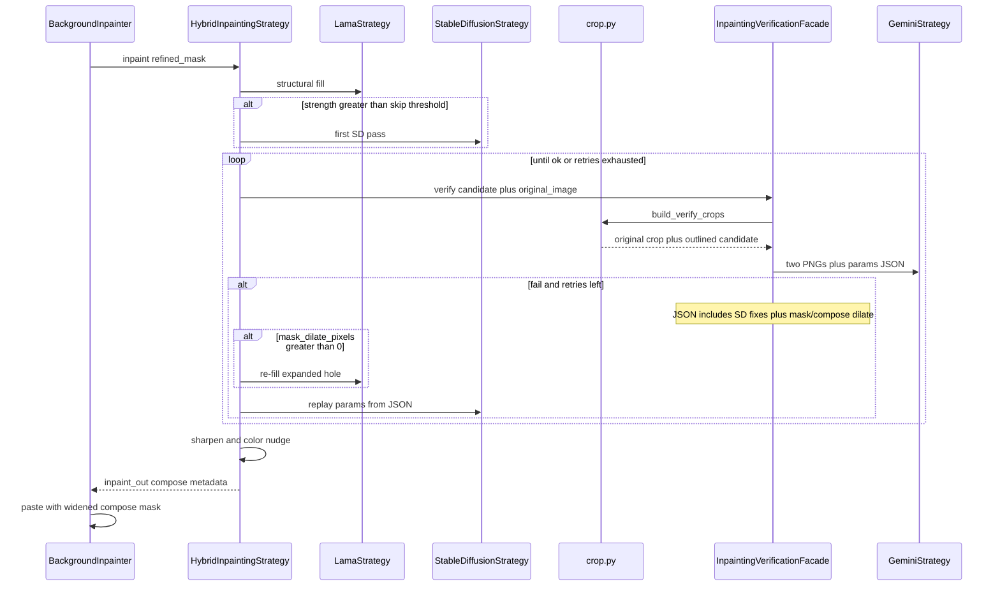

# Inpainting verification flow

Default: compute one padded window from the mask (Gemini pad ratio 0.35, minimum side at least 256 px or 25% of the shorter image edge). Send **original crop** and **outlined candidate crop** plus current params to Gemini. Pass copies input knobs and sets dilate fields to `0`. Fail returns rewritten knobs plus AI-decided `mask_dilate_pixels` / `compose_dilate_pixels`. Placeholder `GEMINI_API_KEY` (or HTTP/JSON failure) uses CLIP labels instead (clean texture vs leftover shadow) with fixed dilate heuristics. On fail with mask dilation, Hybrid re-runs LaMa before SD. Exhausted retries keep the last candidate and log `verification_ok=False`.

Each Gemini attempt emits a structured INFO log (crop size, window, mask pixels, dual-crop flag, retry recipe on fail).
