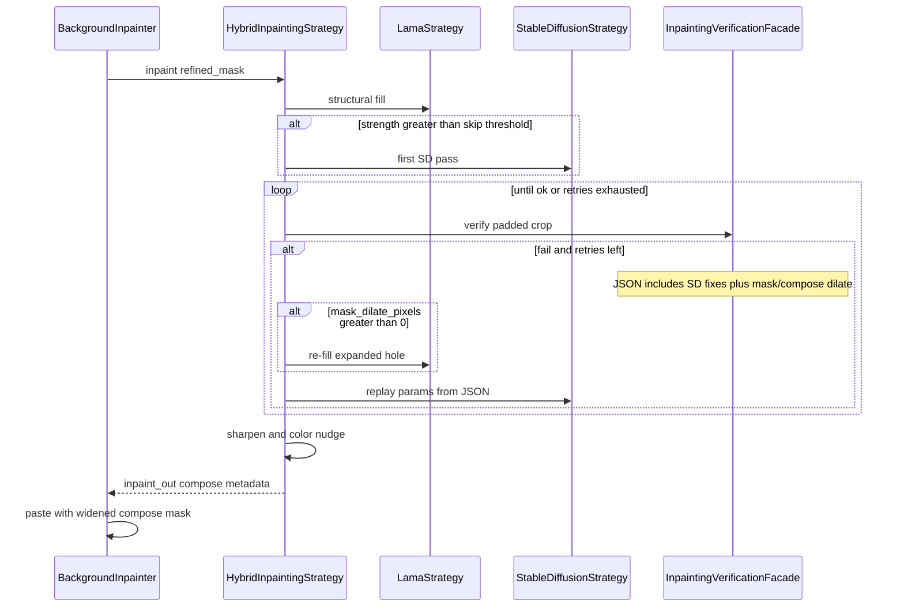

# Inpainting verification flow

Default: pad-crop the mask (Gemini uses 0.35 pad ratio), send crop + current params to Gemini. Pass copies input knobs and sets dilate fields to `0`. Fail returns rewritten knobs plus AI-decided `mask_dilate_pixels` / `compose_dilate_pixels`. Placeholder `GEMINI_API_KEY` (or HTTP/JSON failure) uses CLIP labels instead (clean texture vs leftover shadow) with fixed dilate heuristics. On fail with mask dilation, Hybrid re-runs LaMa before SD. Exhausted retries keep the last candidate and log `verification_ok=False`.
