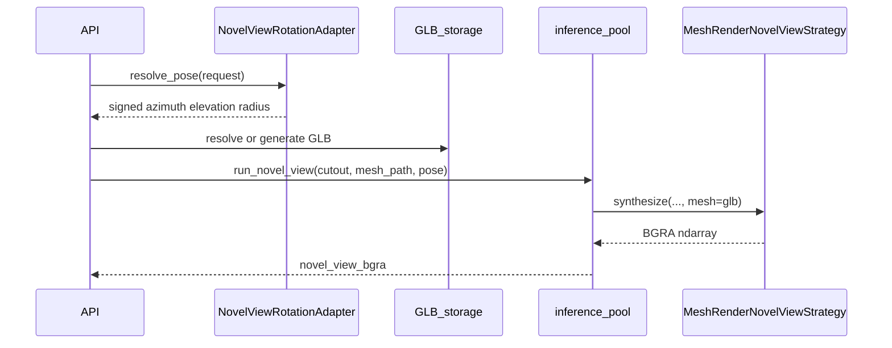

# Novel view execution and data flow

Invoked via `NovelViewFacade.synthesize(...)` or `POST /images/novel-view`.

## HTTP path (mesh render)

1. Resolve cutout path on disk (`{uid}_{object_id}_cutout.png`).
2. Normalize optional pose directions through `NovelViewRotationAdapter.resolve_pose(...)`.
3. **Ensure GLB:** `resolve_object_glb_path`; on miss run `run_generate_3d` and write `{uid}_{object_id}.glb`.
4. Inference pool: `NovelViewFacade(MeshRenderNovelViewStrategy()).synthesize(cutout, mesh=glb, pose)`.
5. Strategy loads/normalizes GLB (recenter + scale), places OrbitControls-compatible camera, pyrender offscreen RGBA, composites onto cutout canvas → BGRA.
6. Encode PNG → base64. No disk cache — nothing is persisted per pose, and no `last_changed` bump.

## Stable Zero123 (facade default / direct Python)

Used when constructing `NovelViewFacade()` without a strategy (not the HTTP path):

1. Normalize to PIL RGBA (`to_pil_rgba`).
2. Crop to alpha bounding box; pad to square; resize to 256×256; composite onto white before RGB model input.
3. Lazy-load Diffusers Zero1to3 pipeline on `kxic/stable-zero123` (override via `NOVEL_VIEW_MODEL_ID`).
4. Run inference with pose `[elevation_deg + relative_elevation_deg, azimuth_deg, radius]`, `guidance_scale≈3`.
5. Remask generated RGB (white background → transparent alpha).
6. Upscale and composite back onto full-size transparent canvas.

`mesh=` is accepted and ignored.

## Pose semantics

**Mesh render (HTTP):** OrbitControls-compatible deltas from a canonical start camera `(0, 1.5, 7)` looking at origin — matches `Model3DFrame.capture()`. `radius` scales distance (`distance = base * (1 + radius)`). Absolute `elevation_deg` is unused for camera placement.

**Zero123:** community pipeline encodes pose as `[elevation, azimuth, radius]`:

- **elevation** — target view elevation in degrees (source absolute + relative delta)
- **azimuth** — relative rotation from source to target
- **radius** — camera distance / zoom (0 = default)

Use **low CFG (~3)**; higher values over-amplify pose conditioning.

## Known limits

- Mesh render quality is limited by the GLB (Hunyuan/TripoSR/etc.); it does not hallucinate unseen texture like Zero123.
- Offscreen OpenGL (pyrender) required for mesh render; headless hosts may need `PYOPENGL_PLATFORM=osmesa` or `egl`.
- Zero123: large azimuth angles hallucinate backsides; pose may not match the GLB orbit.
