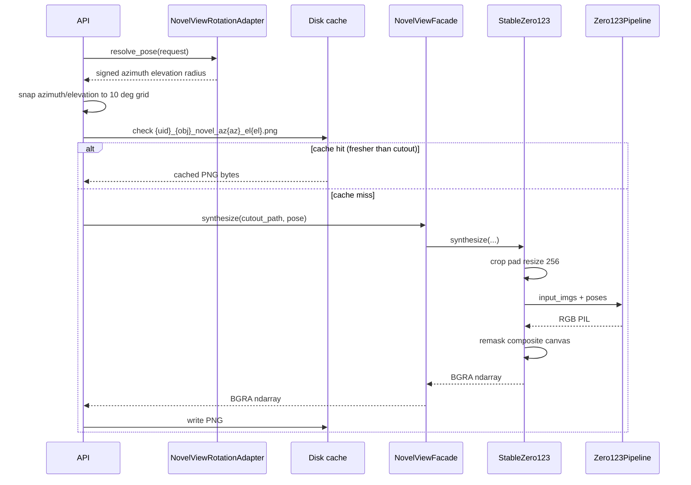

# Novel view execution and data flow

Invoked via `NovelViewFacade.synthesize(...)` or `POST /images/novel-view`.

## Stable Zero123 (default)

1. Resolve cutout path on disk (`{uid}_{object_id}_cutout.png`).
2. **(HTTP only)** Normalize optional pose directions through `NovelViewRotationAdapter.resolve_pose(...)`.
3. **(HTTP only)** Snap resolved azimuth/relative-elevation to the nearest 10° and wrap azimuth into `(-180, 180]` — see [contracts.md](contracts.md#http-layer-pose-snapping-and-cache). Radius is not snapped.
4. **(HTTP only)** Check the disk cache for this exact (snapped azimuth, snapped elevation) pair. If a cache file exists and is newer than the cutout, return it directly — steps 5–10 below are skipped entirely.
5. Normalize to PIL RGBA (`to_pil_rgba`).
6. Crop to alpha bounding box; pad to square; resize to 256×256; composite onto white before RGB model input.
7. Lazy-load Diffusers Zero1to3 pipeline on `kxic/stable-zero123` (override via `NOVEL_VIEW_MODEL_ID`).
8. Run inference with pose `[elevation_deg + relative_elevation_deg, azimuth_deg, radius]`, `guidance_scale≈3`.
9. Remask generated RGB (white background → transparent alpha).
10. Upscale and composite back onto full-size transparent canvas.
11. Encode PNG → base64; compute `cutout_bounds`; persist disk cache; **(HTTP only)** bump session `last_changed`.

## Pose semantics

The Zero1to3 community pipeline encodes pose as `[elevation, azimuth, radius]`:

- **elevation** — target view elevation in degrees (source absolute + relative delta)
- **azimuth** — relative rotation from source to target
- **radius** — camera distance / zoom (0 = default)

Use **low CFG (~3)**; higher values over-amplify pose conditioning.

## Known limits

- Large azimuth angles hallucinate unseen object backsides.
- Pose is not guaranteed geometrically identical to a Trellis GLB orbit view.
- Model is object-centric (Objaverse-style); cutout must be centered and isolated.
