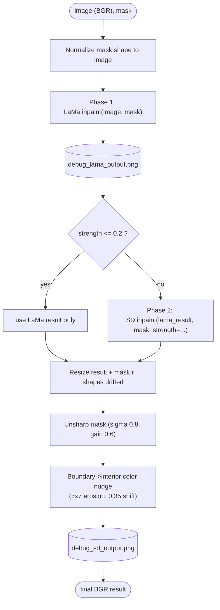

# Inpainting

Three implementations of `IInpainter` ([`interfaces.py`](../../TestModules/src/core/interfaces.py) lines 18–36):

- `LamaInpainter` — fast, structural fill via the LaMa model. Always runs.
- `StableDiffusionInpainter` — generative refinement on top of LaMa. Conditionally runs.
- `HybridInpainter` — composite that wires the two together with pre/post processing.

The orchestrator only ever talks to `HybridInpainter`.

## `HybridInpainter` (the active one)

[`TestModules/src/ai_engines/inpainting/HybridInpainter.py`](../../TestModules/src/ai_engines/inpainting/HybridInpainter.py)

### Pipeline phases



### Source

```27:97:TestModules/src/ai_engines/inpainting/HybridInpainter.py
    def inpaint(self, image: np.ndarray, mask: np.ndarray, **kwargs) -> np.ndarray:
        if mask.ndim == 3:
            mask = mask[:, :, 0]

        # Ensure mask is same size as image (depth/SAM can sometimes differ)
        if mask.shape[:2] != image.shape[:2]:
            mask = cv2.resize(mask, (image.shape[1], image.shape[0]), interpolation=cv2.INTER_NEAREST)
            thresh = 0.5 if mask.max() <= 1.0 else 127
            mask = (mask > thresh).astype(np.uint8) * 255
        logger.info("--- Hybrid Pipeline Phase 1: Structural removal (LaMa) ---")
        lama_result = self.lama.inpaint(image, mask)

        # DEBUG: Save LaMa intermediate result
        self.image_saver.save("debug_lama_output", lama_result)

        logger.info("--- Hybrid Pipeline Phase 2: Texture refinement (SD) ---")
        sd_kwargs = kwargs.copy()
        
        # 1. Apply dynamic SD strength from router.
        # Lower values are safer and preserve empty/background look.
        # Higher values increase generation power but can hallucinate new objects.
        dynamic_strength = kwargs.get('strength', 0.35)
        sd_kwargs['strength'] = dynamic_strength
        logger.info(f"Using dynamic SD strength: {dynamic_strength}")
        # Do not override prompt — use SD inpainter's default (empty floor/carpet, no objects)

        # 2. Skip SD when strength is very low (LaMa-only path: no smear from SD resize, no object hallucination)
        if dynamic_strength <= 0.2:
            final_result = lama_result.copy()
            logger.info("Skipping SD (strength <= 0.2); using LaMa result only.")
        else:
            final_result = self.sd.inpaint(lama_result, mask, **sd_kwargs)

        # Keep result and mask perfectly aligned before boolean indexing.
        # Any shape mismatch here can silently paint wrong pixels or crash later.
        if final_result.shape[:2] != image.shape[:2]:
            final_result = cv2.resize(final_result, (image.shape[1], image.shape[0]), interpolation=cv2.INTER_LANCZOS4)
        if mask.shape[:2] != final_result.shape[:2]:
            mask = cv2.resize(mask, (final_result.shape[1], final_result.shape[0]), interpolation=cv2.INTER_NEAREST)
            thresh = 0.5 if mask.max() <= 1.0 else 127
            mask = (mask > thresh).astype(np.uint8) * 255

        # 3. Sharpen: stronger so inpainted area and reimagined edges match surroundings
        sigma = 0.8
        blurred = cv2.GaussianBlur(final_result, (0, 0), sigma)
        f = final_result.astype(np.float32)
        final_result = np.clip(f + 0.6 * (f - blurred.astype(np.float32)), 0, 255).astype(np.uint8)

        # 4. Nudge color only in mask interior, not on the edge band.
        # Edge pixels can contain reimagined geometry; changing them too much can warp object contours.
        mask_bool = (mask > 127) if (mask.dtype == np.uint8 or mask.max() > 1) else (mask > 0.5)
        if mask_bool.any() and len(final_result.shape) == 3:
            mask_uint = (mask * 255).astype(np.uint8) if mask.max() <= 1 else mask.astype(np.uint8)
            kernel = np.ones((3, 3), np.uint8)
            boundary = (cv2.dilate(mask_uint, kernel) > 0) & (~mask_bool)
            # Erode mask so we only adjust interior (background) pixels, not the reimagined edge band
            interior_only = cv2.erode(mask_uint, np.ones((7, 7), np.uint8)) > 127
            if boundary.any() and interior_only.any():
                boundary_mean = final_result[boundary].mean(axis=0)
                inside_mean = final_result[interior_only].mean(axis=0)
                shift = (boundary_mean.astype(np.float32) - inside_mean.astype(np.float32)) * 0.35
                out = final_result.astype(np.float32)
                out[interior_only] = np.clip(out[interior_only] + shift, 0, 255)
                final_result = out.astype(np.uint8)
        # (Removed extra mask-only sharpen — it made reimagined edges look weird and not match object shape)

        # DEBUG: Save Stable Diffusion intermediate/final result
        self.image_saver.save("debug_sd_output", final_result)

        logger.info("Hybrid Pipeline completed successfully.")
        return final_result
```

### Things to know

- **Skip threshold** for SD is `0.2`. Today the router always returns `0.35`, so SD always runs in the production path. To force LaMa-only, drop strength below `0.2`.
- **Color nudge** shifts only the **interior** of the mask (after a `7×7` erosion) toward the boundary mean by `0.35`. It is intentional — it pulls the inpainted region toward surrounding tones without disturbing the reimagined edges.
- **Unsharp** uses Gaussian sigma `0.8` and gain `0.6`.
- **Two debug PNGs** are written: `debug_lama_output.png` after phase 1 and `debug_sd_output.png` after the post-processing.

## `LamaInpainter`

[`TestModules/src/ai_engines/inpainting/LamaInpainter.py`](../../TestModules/src/ai_engines/inpainting/LamaInpainter.py)

Singleton wrapper over `simple_lama_inpainting.SimpleLama`. The interesting bit is what happens **before** SimpleLama runs:

```24:52:TestModules/src/ai_engines/inpainting/LamaInpainter.py
    def inpaint(self, image: np.ndarray, mask: np.ndarray) -> np.ndarray:
        """
        Inpaint an image given a mask using the SimpleLama model.
        Accepts and returns numpy arrays (cv2 compatible).
        """
        logger.info("Starting inpainting process...")
        print("Starting inpainting process...")

        if mask.ndim == 3:
            mask = mask[:, :, 0]
        if mask.shape[:2] != image.shape[:2]:
            mask = cv2.resize(mask, (image.shape[1], image.shape[0]), interpolation=cv2.INTER_NEAREST)
            thresh = 0.5 if mask.max() <= 1.0 else 127
            mask = (mask > thresh).astype(np.uint8) * 255
        
        # 0. So LaMa is not conditioned on the removed object's pixels (avoids ghost where it obstructed another object),
        #    fill the mask region with the mean color of the mask boundary only. Mask size and shape are unchanged.
        mask_uint = (mask * 255).astype(np.uint8) if mask.max() <= 1 else mask.astype(np.uint8)
        mask_bool = mask_uint > 127
        if mask_bool.any():
            kernel = np.ones((3, 3), np.uint8)
            boundary = (cv2.dilate(mask_uint, kernel) > 0) & (~mask_bool)
            if boundary.any():
                if len(image.shape) == 3:
                    fill = np.round(image[boundary].mean(axis=0)).astype(image.dtype)
                else:
                    fill = np.round(image[boundary].mean()).astype(image.dtype)
                image = image.copy()
                image[mask_bool] = fill
```

The masked area is replaced with the **mean color of the boundary ring** before LaMa runs — so LaMa is never conditioned on the object's own pixels. This avoids "ghost of the removed object" artifacts especially when the object partially obscured another.

After LaMa runs, the result is converted RGB→BGR so the rest of the OpenCV-based pipeline keeps working.

## `StableDiffusionInpainter`

[`TestModules/src/ai_engines/inpainting/StableDiffusionInpainter.py`](../../TestModules/src/ai_engines/inpainting/StableDiffusionInpainter.py)

Wraps `diffusers.StableDiffusionInpaintPipeline`. Key constants:

| | Value |
|---|---|
| Model id | `runwayml/stable-diffusion-inpainting` ([line 16](../../TestModules/src/ai_engines/inpainting/StableDiffusionInpainter.py)) |
| Device | `cuda` if available, else `cpu`; `float16` on CUDA, `float32` on CPU ([lines 18, 25](../../TestModules/src/ai_engines/inpainting/StableDiffusionInpainter.py)) |
| Prompt | `"seamless plain flat background texture, photorealistic background, empty space"` ([line 34](../../TestModules/src/ai_engines/inpainting/StableDiffusionInpainter.py)) |
| Negative prompt | long list — `"furniture, table, couch, chair, sofa, ottoman, pouf, stool, vase, plant, object, item, thing, decor, shadow, 3d, person, animal, clutter, artifact, pedestal, box, blurry, smeared, ghost"` ([line 35](../../TestModules/src/ai_engines/inpainting/StableDiffusionInpainter.py)) |
| Inference steps | `30` ([line 70](../../TestModules/src/ai_engines/inpainting/StableDiffusionInpainter.py)) |
| Guidance scale | `10.0` ([line 71](../../TestModules/src/ai_engines/inpainting/StableDiffusionInpainter.py)) |
| Strength default | `0.35` ([line 41](../../TestModules/src/ai_engines/inpainting/StableDiffusionInpainter.py)) |
| Working size | `512×512` ([line 56](../../TestModules/src/ai_engines/inpainting/StableDiffusionInpainter.py)) |

Image is resized to 512² before SD, then back to original size with LANCZOS after. The mask is binarized and fed in as `L` mode.

The negative prompt is the safety mechanism that keeps SD from "filling the empty space with another object" — the prompt asks for empty background, the negatives forbid common indoor furniture.
