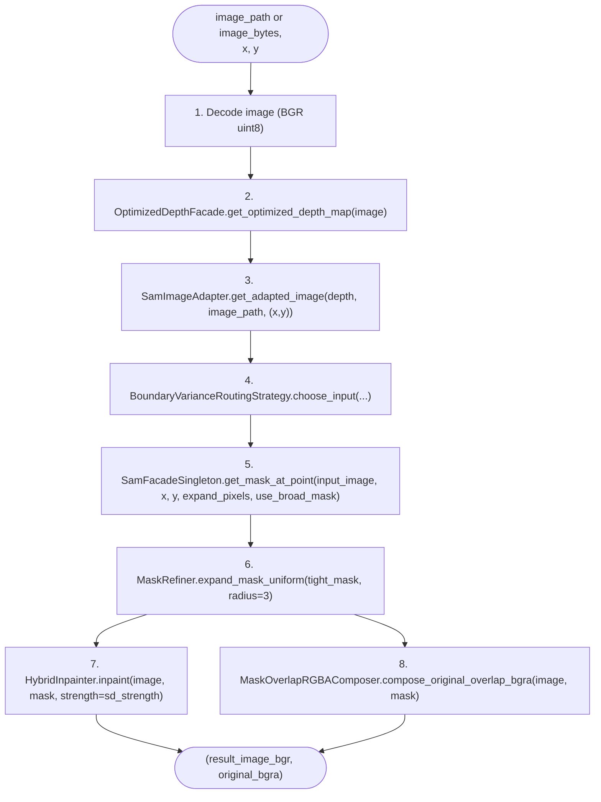

# ObjectRemover (orchestrator)

[`TestModules/src/core/objectRemover.py`](../../TestModules/src/core/objectRemover.py) defines the pipeline. It owns one instance of each engine/strategy and calls them in a fixed order.

## Construction

```38:54:TestModules/src/core/objectRemover.py
class ObjectRemover:
    def __init__(self):
        # AI Engines
        self.sam = SamFacadeSingleton()
        self.inpainter: IInpainter = HybridInpainter()
        
        # Architecture Components 
        self.depth_facade = OptimizedDepthFacade(threshold=100)
        self.sam_adapter = SamImageAdapter()
        self.router = BoundaryVarianceRoutingStrategy(sam_facade=self.sam)
        self.mask_refiner = MaskRefiner(depth_tolerance=10)

        self.image_saver = DebugImageSaver()
        
        self.image_path = None
        self.point = None
        logger.info("ObjectRemover initialized")
```

Constants worth noting:

- `OptimizedDepthFacade(threshold=100)` — passed but not actually used in the depth facade body today (see [depth.md](depth.md)).
- `MaskRefiner(depth_tolerance=10)` — the depth-tolerance parameter is only used by `expand_and_clip`, which the pipeline does **not** call (it uses `expand_mask_uniform` instead — see [utils.md](utils.md)).
- The router is given `self.sam` so it can ask SAM for a probe mask without holding its own SAM instance.

The other heavy components are singletons (`SamFacadeSingleton`, `LamaInpainter`, `ImageDepthMapper`) so subsequent `ObjectRemover()` calls don't reload model weights.

## The eight pipeline stages

`ObjectRemover.remove_object(image_path, x, y, depth_output_flag=False, image_bytes=None)` — defined at lines 64–183.



### Stage 1 — Decode

```73:84:TestModules/src/core/objectRemover.py
        if image_bytes is not None:
            # Decode uploaded image bytes into an OpenCV BGR array.
            nparr = np.frombuffer(image_bytes, np.uint8)
            image = cv2.imdecode(nparr, cv2.IMREAD_COLOR)
            if image is None:
                logger.error("Could not decode image bytes for inpaint pipeline")
                raise ValueError("Could not decode image bytes into an image array")
        else:
            image = cv2.imread(image_path)
            if image is None:
                logger.error(f"Could not load image: {image_path}")
                raise FileNotFoundError(f"Could not load image: {image_path}")
```

The HTTP path always passes `image_bytes` and a synthetic `image_path = "memory://<sha256>"` (the path is reused as the cache key inside `SamImageAdapter`).

### Stage 2 — Depth

```86:89:TestModules/src/core/objectRemover.py
        # 1. Depth Facade
        logger.info("Step 1: Computing optimized depth map...")
        optimized_depth = self.depth_facade.get_optimized_depth_map(image)
        self.image_saver.save("optimized_depth", optimized_depth)
```

Output: `uint8` HxW grayscale depth, also saved as `outputs/optimized_depth.png`. See [depth.md](depth.md).

### Stage 3 — Adapt for SAM

```93:99:TestModules/src/core/objectRemover.py
        # 2. Adapter with Cache
        logger.info("Step 2: Adapting data...")
        adapted_for_sam = self.sam_adapter.get_adapted_image(
            raw_data=optimized_depth,
            image_id=image_path,
            point=(x, y)
        )
        self.image_saver.save("adapted_for_sam", adapted_for_sam)
```

Converts the single-channel depth into the 3-channel array SAM expects, with caching keyed on `(image_path, x, y)`. See [segmentation.md](segmentation.md).

### Stage 4 — Route

```104:111:TestModules/src/core/objectRemover.py
        run_context = self.router.choose_input(
            rgb_image=image, 
            raw_depth=optimized_depth, 
            adapted_depth=adapted_for_sam, 
            x=x, y=y
        )
```

Returns a dict `{ input_image, sd_strength, use_broad_mask, expand_pixels }`. See [routing.md](routing.md).

### Stage 5 — Tight SAM mask

```116:123:TestModules/src/core/objectRemover.py
        tight_mask = self.sam.get_mask_at_point(
            run_context['input_image'], 
            x, y, 
            expand_pixels=run_context.get('expand_pixels', 14),
            use_broad_mask=run_context['use_broad_mask'] 
        )
        tight_mask = _ensure_mask_hw(tight_mask, image.shape[:2])
        self.image_saver.save("tight_mask", tight_mask)
```

`_ensure_mask_hw` (lines 13–28) resizes the mask to image dims with nearest-neighbor and keeps it binary.

### Stage 6 — Uniform expansion

```137:145:TestModules/src/core/objectRemover.py
        # Step 2: do a small and uniform expansion after the tight mask is found.
        # This helps cover object edge pixels that SAM can miss by 1-3 pixels.
        logger.info("Refining mask using simple uniform dilation (~3px expansion)...")
        mask = self.mask_refiner.expand_mask_uniform(
            original_mask=tight_mask,
            radius=3
        )
        mask = _ensure_mask_hw(mask, image.shape[:2])
        
        # Save the refined mask for debugging.
        self.image_saver.save("mask", mask)
```

A small, depth-agnostic dilation. The `expand_pixels` from the router is applied earlier, **inside SAM**, by `SamFacadeSingleton.get_mask_at_point` ([`SamFacadeSingleton.py`](../../TestModules/src/ai_engines/segmentation/SamFacadeSingleton.py) lines 116–119).

### Stage 7 — Hybrid inpaint

```163:167:TestModules/src/core/objectRemover.py
        result_image = self.inpainter.inpaint(
            image, 
            mask, 
            strength=run_context['sd_strength'] 
        )
```

LaMa first; SD is run only when `sd_strength > 0.2`. See [inpainting.md](inpainting.md).

### Stage 8 — Compose cutout

```178:183:TestModules/src/core/objectRemover.py
        original_bg_ra = MaskOverlapRGBAComposer.compose_original_overlap_bgra(
            original_bgr=image,
            mask=mask,
        )

        return result_image, original_bg_ra
```

`result_image` is BGR uint8 (the background after object removal). `original_bg_ra` is BGRA uint8 — the original image with `alpha=255` only where the mask was set, `alpha=0` elsewhere (the cutout).

## Things to know about this orchestrator

- **`depth_output_flag` is unused.** It's accepted as a parameter for backward compatibility but never branched on inside the body.
- **Two debug overlays are written from the orchestrator** in addition to the engine-level debug images: `debug_tight_mask_overlay` (lines 128–132) and `debug_mask_overlay` (lines 150–156) — both whitewash the masked area on top of the original image. See [outputs.md](outputs.md).
- **The depth tolerance on `MaskRefiner`** (passed in `__init__`) is dead code in the current flow. The pipeline calls `expand_mask_uniform`, not `expand_and_clip`.
- **`remove_object_test`** (lines 185–197) is a small helper that re-uses `image_path` and `point` set via `set_image` / `set_point`. It is not used by the API; mostly for the GUI test harness.
