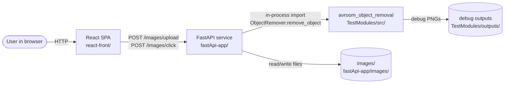

# System Architecture

Avroom is a three-tier system. The frontend talks to the backend over HTTP; the backend talks to the AI pipeline as an in-process Python import (no separate process, no IPC).

## Component diagram



## Tier responsibilities

### Frontend — [react-front/](../react-front/)

- React 19 + Vite 5 SPA, single route, no router/state libraries.
- Lets the user pick a file, preview it, click on it, and trigger processing.
- Talks to the backend through [`react-front/src/api/images.ts`](../react-front/src/api/images.ts) (`fetch`, base URL from `VITE_API_BASE_URL` or `http://127.0.0.1:8000`).
- Sends **natural** image coordinates (un-scaled by display) so the backend always works in image pixels.
- See [frontend/](frontend/README.md) for details.

### Backend — [fastApi-app/](../fastApi-app/)

- FastAPI app declared in [`fastApi-app/main.py`](../fastApi-app/main.py); `/images` router from [`fastApi-app/api/routes.py`](../fastApi-app/api/routes.py).
- CORS allows `http://localhost:5173` and `http://127.0.0.1:5173` (Vite default) — see [`fastApi-app/main.py`](../fastApi-app/main.py) lines 16–22.
- Persists uploads on local disk (default `fastApi-app/images/`, see [`fastApi-app/settings.py`](../fastApi-app/settings.py)).
- Performs the actual segmentation/inpainting by calling the AI pipeline directly from [`fastApi-app/core/image_processing.py`](../fastApi-app/core/image_processing.py).
- See [backend/](backend/README.md) for details.

### AI pipeline — [TestModules/](../TestModules/)

- Distributed as Python package `avroom_object_removal` (sources under `TestModules/src/`, imported as `avroom_object_removal.*`).
- Installed editable via the root [`requirements.txt`](../requirements.txt) line 1: `-e ./TestModules`.
- Public surface is `ObjectRemover` plus four per-domain Facades (`DepthMappingFacade`, `ImageSegmentationFacade`, `ImageInpaintingFacade`, `Reconstruction3DFacade`) and their Strategy ABCs — all re-exported from [`TestModules/src/__init__.py`](../TestModules/src/__init__.py).
- `ObjectRemover.remove_object` orchestrates depth mapping → adapter → router → SAM → mask refinement → hybrid inpainting → BGRA cutout composition.
- `Reconstruction3DFacade` is a separate, optional surface for image-to-3D (GLB). It **defaults** to local **OpenLRM** (`OpenLrmReconstructionStrategy`); **Trellis 2** via `gradio_client` is available when that strategy is injected. It is **not** invoked by `ObjectRemover` or by the HTTP endpoints today.
- See [ai-pipeline/](ai-pipeline/README.md) for details.

## Cross-tier contracts

Two HTTP endpoints, both under `/images`:

| Endpoint | Request | Response |
|---|---|---|
| `POST /images/upload` | `multipart/form-data` with `file` | `ImageUploadResponse` (`image_id`, `original_filename`, `stored_path`) |
| `POST /images/click` | `ClickRequest` (`image_id`, `x`, `y`, optional `options`) | `ClickResultResponse` (`background_b64`, `cutout_b64`, `format`) |

Schemas in [`fastApi-app/schemas/image.py`](../fastApi-app/schemas/image.py); frontend mirrors them in [`react-front/src/types/api.ts`](../react-front/src/types/api.ts).

The backend ↔ pipeline contract is the single Python call:

```89:96:fastApi-app/core/image_processing.py
    remover = _get_object_remover_class()()
    image_key = f"memory://{hashlib.sha256(image_bytes).hexdigest()}"
    background_bgr, cutout_bgra = remover.remove_object(
        image_path=image_key,
        x=x,
        y=y,
        image_bytes=image_bytes,
    )
```

`remove_object` accepts `image_path`, `x`, `y`, an optional `image_bytes` (used in the API path so it never needs to re-read from disk), and returns `(background_bgr, cutout_bgra)` numpy arrays which the backend PNG-encodes.

## Process / deployment model

- The frontend builds to static assets via `vite build`; in dev, `npm run dev` (port 5173) talks to a local FastAPI (port 8000 by default).
- The FastAPI service runs as a normal ASGI app (`main:app` per [`fastApi-app/pyproject.toml`](../fastApi-app/pyproject.toml)). It needs CUDA + torch + the SAM checkpoint to actually run inference, otherwise the pipeline import will succeed but the call will fail at SAM/SD load time.
- The AI pipeline writes debug PNGs to `TestModules/outputs/` during every call (see [ai-pipeline/core/README.md](ai-pipeline/core/README.md)).

## Where to read next

- [data-flow.md](data-flow.md) — full request lifecycle, click → result.
- [tech-stack.md](tech-stack.md) — concrete versions of every dependency.
- [conventions.md](conventions.md) — design patterns and project-wide rules.
