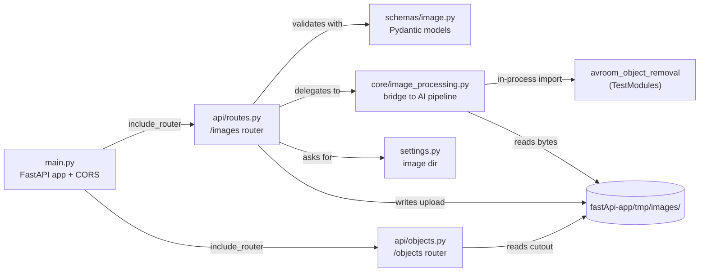

# Backend Docs

The FastAPI service in [`fastApi-app/`](../../fastApi-app/) is a thin HTTP shell over the AI pipeline. It manages image storage, validates input, and calls `ObjectRemover` in-process.

## Pages

- [overview.md](overview.md) — what the service is and how it's wired.
- [api-endpoints.md](api-endpoints.md) — every HTTP endpoint with request/response.
- [core-image-processing.md](core-image-processing.md) — the bridge module that calls into the AI pipeline.
- [schemas.md](schemas.md) — Pydantic models.
- [settings-and-storage.md](settings-and-storage.md) — image storage directory resolution.
- [data-flow.md](data-flow.md) — request lifecycle for upload + click.

## At a glance

