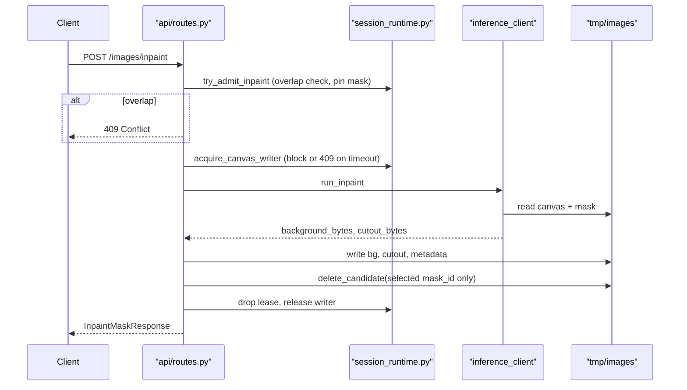
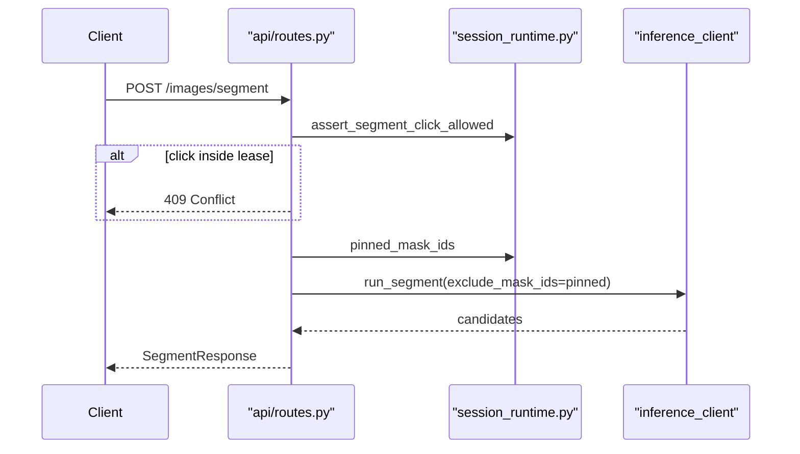

# Backend Concurrency

The FastAPI service coordinates same-session segment and inpaint work in the **API process**. GPU execution may run inline (default) or in optional worker subprocesses, but session-level locks and region leases always live in the API process — workers remain GPU-only.

## Two execution modes

| Mode | Config | GPU serialization |
|------|--------|-------------------|
| Inline (default) | `INFERENCE_WORKERS=0` | Process-wide `inference_session()` lock in [`core/inference_lock.py`](../../fastApi-app/core/inference_lock.py) |
| Worker pool | `INFERENCE_WORKERS=N` (1–8) | N spawn subprocesses, each with its own model stack (~N× VRAM) |

Pool startup is wired in [`fastApi-app/main.py`](../../fastApi-app/main.py) lifespan via [`core/inference_pool/pool.py`](../../fastApi-app/core/inference_pool/pool.py). Jobs are submitted through [`core/inference_pool/client.py`](../../fastApi-app/core/inference_pool/client.py) and dispatched by [`core/inference_pool/dispatch.py`](../../fastApi-app/core/inference_pool/dispatch.py).

Heavy routes (`segment`, `inpaint`, legacy `click`, 3D, novel view, `POST /images/{uid}/batch`) are synchronous `def` handlers so Starlette runs them on a thread pool and the event loop stays responsive for light GETs.

## Session runtime (API process)

Module: [`core/inference_pool/session_runtime.py`](../../fastApi-app/core/inference_pool/session_runtime.py)

### Canvas writer

At most **one inpaint GPU + commit** may run per `image_id` at a time. A second non-overlapping inpaint **blocks** on the canvas writer until the first finishes, then loads the **updated** canvas.

- Acquired in [`api/routes.py`](../../fastApi-app/api/routes.py) `inpaint_mask` before `run_inpaint`.
- Held through GPU work, metadata build, background/cutout writes, and per-mask candidate delete. Batch peels acquire the writer **one object at a time** so overlapping sibling masks queue instead of 409.
- Writer wait timeout reuses `INFERENCE_JOB_TIMEOUT_SEC` (default 600). On timeout → HTTP **409** with a clear detail.

### Region leases

When an inpaint is admitted, the API registers a **lease** for the selected mask:

- Loads `{uid}_mask_{mask_id}_refined.npy` and keeps a boolean mask in memory for overlap tests.
- **Pins** that `mask_id` on disk so concurrent segment wipes cannot delete it.
- Overlapping inpaint admits or segment clicks inside the leased region → HTTP **409**.
- Lease is dropped in a `finally` block after inpaint completes or fails.

This enables **segment during inpaint** on a non-overlapping region: segment may run while one object is being removed, as long as the click does not fall inside an active lease.

### Conflict responses

`SessionConflictError` from session runtime maps to HTTP **409 Conflict** in segment and inpaint routes. Examples:

- Inpaint mask overlaps an in-flight removal.
- Segment click falls inside an in-flight removal region.
- Canvas writer timeout while another inpaint holds the session.

The React frontend now runs concurrent inpaints too (`react-front/src/hooks/useSessionJobs.ts`): selecting a mask closes the picker and fires inpaint detached, so a user can start a second non-overlapping removal before the first one's response lands. Segment stays single-flight client-side (it drives one interactive picker), but the underlying API always allowed concurrent segment/inpaint calls. 409s from either surface as a dismissible inline notice (`useConflictNotices`) rather than the error modal.

## Candidate file lifecycle

Module: [`core/mask_cache.py`](../../fastApi-app/core/mask_cache.py)

| Event | Candidate behavior |
|-------|-------------------|
| New segment | `delete_candidates(..., exclude_mask_ids=pinned)` — wipes stale candidates except masks pinned by active inpaint leases |
| Segment save | Assigns `mask_id` via `mask_id_for_candidate_slot`, skipping pinned ids so new files never overwrite in-flight masks |
| Successful inpaint | `delete_candidate(image_id, mask_id)` — removes **only** the selected mask's temp files |
| Session delete | `delete_candidates` (full wipe) |

Filenames unchanged: `{uid}_mask_{mask_id}_refined.npy` and `{uid}_mask_{mask_id}_cutout.png`.

## Inpaint lifecycle (route-level)

## Segment lifecycle (route-level)

Segment does **not** acquire the canvas writer. It may read a pre-commit canvas while an inpaint is in flight — correct for ahead-of-time masks on unchanged pixels.

## What is not coordinated

- **Legacy** `POST /images/click` — still writes background without session runtime (unchanged).
- **Cross-session** work — no session locks between different `image_id` values; the worker pool parallelizes across sessions.
- **Object metadata index** (`object_index.json`) — read-modify-write under inpaint commit only; not a separate distributed lock.
- **Mid-GPU cancellation** — not supported; conflicts are detected at admit or writer acquire, not inside LaMa/SD.

## Related modules

| Module | Role |
|--------|------|
| [`core/inference_pool/session_runtime.py`](../../fastApi-app/core/inference_pool/session_runtime.py) | Canvas writer, region leases, overlap checks |
| [`core/inference_pool/session_lock.py`](../../fastApi-app/core/inference_pool/session_lock.py) | Thin wrapper around canvas writer for tests |
| [`core/mask_cache.py`](../../fastApi-app/core/mask_cache.py) | Per-mask delete, exclude pins on wipe |
| [`core/inference_lock.py`](../../fastApi-app/core/inference_lock.py) | Process-wide GPU lock (inline mode) |
| [`settings.py`](../../fastApi-app/settings.py) | `INFERENCE_WORKERS`, `INFERENCE_JOB_TIMEOUT_SEC` |

## Tests

Concurrency unit tests: [`fastApi-app/tests/test_session_runtime.py`](../../fastApi-app/tests/test_session_runtime.py), [`fastApi-app/tests/test_inference_pool.py`](../../fastApi-app/tests/test_inference_pool.py), [`fastApi-app/tests/test_concurrency.py`](../../fastApi-app/tests/test_concurrency.py).
