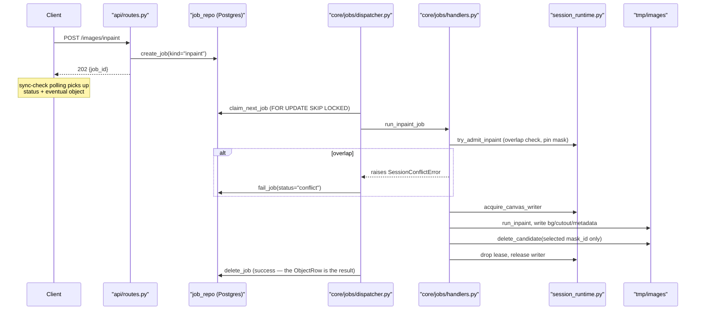
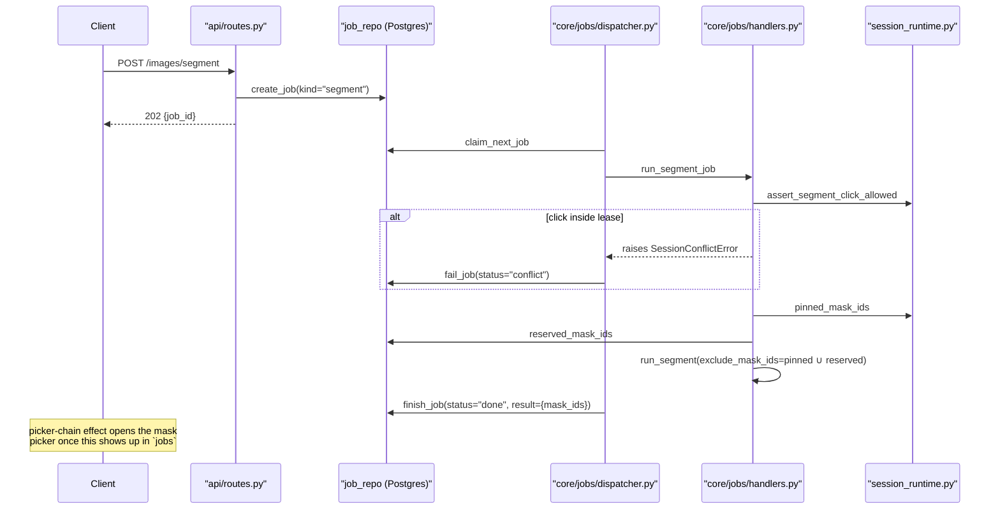

# Backend Concurrency

**Segment, inpaint, erase, and 3D generation are queued, not blocking.** `POST /images/segment`, `POST /images/inpaint`, `POST /images/erase`, and `POST /3d/test-3d` insert a `JobRow` (`fastApi-app/db/models.py`) and return `202 {job_id}` immediately — everything below this line (the canvas writer, region leases, the GPU lock) now runs inside the job dispatcher, not inside the HTTP request. See [Job queue](#job-queue) for the front door; the rest of this document describes what happens once a job is claimed.

The FastAPI service coordinates same-session segment and inpaint work in the **API process**. GPU execution may run inline (default) or in optional worker subprocesses, but session-level locks and region leases always live in the API process — workers remain GPU-only.

## Job queue

Module: [`core/repositories/job_repo.py`](../../fastApi-app/core/repositories/job_repo.py) (Postgres-backed, `jobs` table), [`core/jobs/handlers.py`](../../fastApi-app/core/jobs/handlers.py) (the actual work, one function per kind — the former route bodies), [`core/jobs/dispatcher.py`](../../fastApi-app/core/jobs/dispatcher.py) (drains the queue).

- **Submit**: `create_job(user_id, session_id, kind, payload)` inserts a `queued` row and returns immediately. `user_id` comes from `core/auth/identity.py::current_user_id()` — the one seam a future `AUTH_MODE=jwt` will change — and is the routing key that lets multiple users share one queue without cross-talk.
- **Claim**: `claim_next_job()` is one `SELECT ... FOR UPDATE SKIP LOCKED ORDER BY created_at LIMIT 1` followed by an update to `running`. This is plain FIFO across every user and session, and the `SKIP LOCKED` is what lets `max(1, INFERENCE_WORKERS)` dispatcher threads (or, in the future, multiple API instances) claim rows concurrently without ever double-claiming — the database does the serialization, not an application lock.
- **Run**: the claimed job dispatches to `run_segment_job` / `run_inpaint_job` / `run_erase_job` / `run_generate_3d_job`, each of which does exactly what the corresponding route used to do inline, including the canvas-writer/lease sandwich described below.
- **Finish**: a successful `inpaint`/`erase`/`generate_3d` job **deletes its own row** — the `ObjectRow` / GLB file (or, for erase, the updated `{uid}_background.png`) *is* the durable result, so keeping a `done` row would just duplicate truth. A successful `segment` job is marked `done` with `result = {"mask_ids": [...]}` and stays until the frontend consumes it (an inpaint submitted with `from_job_id` set) or dismisses it (`DELETE /jobs/{job_id}`).
- **Fail**: a handler raising `SessionConflictError` ends the row at status `conflict` (this is where the old synchronous 409 went — see below); any other exception ends it at `failed` with the exception text in `error`.
- **Orphans**: on startup, `mark_running_orphans_failed()` flips any row still `running` (from a process that died mid-job) to `failed`. `queued` rows need no such sweep — a fresh dispatcher just claims them.
- **Delivery**: no push, no dedicated job-status websocket. `POST /images/{uid}/sync-check` (already polled every ~2s while `hasPendingWork` is true) now also returns that session's `jobs` list; `GET /jobs/active` is the same idea across every session, for the dashboard's per-card busy/failed dot; `GET /jobs/{job_id}` returns one job, inflating a done segment job's `mask_ids` into full `SegmentMaskResult`s (base64 cutout + bounds) on read from the still-on-disk candidate files.

**Segment results can pile up.** Nothing stops a user from clicking three different spots before looking at any of them — three `segment` jobs, three `done` rows, in FIFO order. Both the dispatcher's exclusion set and the frontend's picker chain (`useSessionJobs.ts`'s `segmentQueue` effect) treat this as a backlog: the first ready result's mask picker opens automatically, the rest wait and open one after another as each is resolved or dismissed.

## Two execution modes

| Mode | Config | GPU serialization |
|------|--------|-------------------|
| Inline (default) | `INFERENCE_WORKERS=0` | Process-wide `inference_session()` lock in [`core/inference_lock.py`](../../fastApi-app/core/inference_lock.py) |
| Worker pool | `INFERENCE_WORKERS=N` (1–8) | N spawn subprocesses, each with its own model stack (~N× VRAM) |

Pool startup is wired in [`fastApi-app/main.py`](../../fastApi-app/main.py) lifespan via [`core/inference_pool/pool.py`](../../fastApi-app/core/inference_pool/pool.py). Jobs are submitted through [`core/inference_pool/client.py`](../../fastApi-app/core/inference_pool/client.py) and dispatched by [`core/inference_pool/dispatch.py`](../../fastApi-app/core/inference_pool/dispatch.py).

Only the genuinely still-blocking routes stay synchronous `def` handlers now: legacy `POST /images/click`, `duplicate_object`, `delete_object`, `POST /images/objects/{uuid}/rescale-by-depth`, smart-paste (same depth-rescale path), and `POST /images/novel-view`. `segment_image`, `inpaint_mask`, `erase_region`, and `generate_test_3d` are `async def` again — they only insert a `JobRow` and return, so there is no GPU work left on the request thread to protect the event loop from. That work moved to the dispatcher threads in `core/jobs/dispatcher.py`, which is where `INFERENCE_WORKERS`-driven parallelism (and the GPU lock below) still applies.

## Session runtime (API process)

Module: [`core/inference_pool/session_runtime.py`](../../fastApi-app/core/inference_pool/session_runtime.py)

### Canvas writer

At most **one inpaint GPU + commit** may run per `image_id` at a time. A second non-overlapping inpaint **blocks** on the canvas writer until the first finishes, then loads the **updated** canvas.

- Acquired in [`core/jobs/handlers.py`](../../fastApi-app/core/jobs/handlers.py) `run_inpaint_job` before `run_inpaint` (moved here from the `inpaint_mask` route body when inpaint became queued).
- Held through GPU work, metadata build, background/cutout writes, and per-mask candidate delete. Batch peels acquire the writer **one object at a time** so overlapping sibling masks queue instead of conflict.
- Writer wait timeout reuses `INFERENCE_JOB_TIMEOUT_SEC` (default 600) when `INFERENCE_JOB_TIMEOUT` is true (default). `INFERENCE_JOB_TIMEOUT=false` waits until the job finishes. On timeout the job ends at status **`conflict`**, not an HTTP 409 — there is no request left open to 409 against.

### Region leases

When an inpaint is admitted, the API registers a **lease** for the selected mask:

- Loads `{uid}_mask_{mask_id}_refined.npy` and keeps a boolean mask in memory for overlap tests.
- **Pins** that `mask_id` on disk so concurrent segment wipes cannot delete it.
- Overlapping inpaint admits or segment clicks inside the leased region end the *job* at status **`conflict`** (see below) — never an HTTP 409, since the submitting request already returned.
- Lease is dropped in a `finally` block after inpaint completes or fails.

This enables **segment during inpaint** on a non-overlapping region: segment may run while one object is being removed, as long as the click does not fall inside an active lease.

### Conflict status (was: 409 responses)

`SessionConflictError` raised inside a job handler is caught by the dispatcher (`core/jobs/dispatcher.py::_dispatch_one`) and turned into `fail_job(job_id, "conflict", str(exc))` — the row itself carries the reason. Examples, unchanged from before:

- Inpaint mask overlaps an in-flight removal.
- Segment click falls inside an in-flight removal region.
- Canvas writer timeout while another inpaint holds the session.

Because conflicts are now detected **at execution, not at submit**, `POST /images/segment` and `POST /images/inpaint` always return `202` — a click that will turn out to conflict still queues successfully, and the conflict surfaces later. The React frontend (`react-front/src/hooks/useSessionJobs.ts`) watches its session's `jobs` list for a `conflict` status, fires the same inline notice a synchronous 409 used to (`useConflictNotices`) via an `onConflict` callback, then dismisses the row — so the UX is unchanged even though the transport underneath is not a direct error response anymore. Segment and inpaint are both fully async now (several segment results can be queued and waiting at once — see [Job queue](#job-queue)); there is no more client-side single-flight restriction on segment.

## Candidate file lifecycle

Module: [`core/mask_cache.py`](../../fastApi-app/core/mask_cache.py)

| Event | Candidate behavior |
|-------|-------------------|
| New segment | `delete_candidates(..., exclude_mask_ids=pinned ∪ reserved)` — wipes stale candidates except masks pinned by active inpaint leases **or** reserved by an unconsumed `done` segment job / a `queued`/`running` inpaint job (`core/repositories/job_repo.py::reserved_mask_ids`) |
| Segment save | Assigns `mask_id` via `mask_id_for_candidate_slot`, skipping pinned/reserved ids so new files never overwrite in-flight or unconsumed masks |
| Successful inpaint | `delete_candidate(image_id, mask_id)` — removes **only** the selected mask's temp files |
| Session delete | `delete_candidates` (full wipe) |

Filenames unchanged: `{uid}_mask_{mask_id}_refined.npy` and `{uid}_mask_{mask_id}_cutout.png`.

`reserved_mask_ids` exists because the queue widened a race that used to be negligible: under the old synchronous flow, the window between "user picks a mask" and "the API admits the lease" was one HTTP request's worth of latency. Now a submitted inpaint can sit `queued` for an arbitrary amount of time before a dispatcher thread claims it and actually takes the lease — so a concurrent segment's candidate wipe has to know about that not-yet-running inpaint's mask id too, not just live leases.

## Inpaint lifecycle

## Segment lifecycle

Segment does **not** acquire the canvas writer. It may read a pre-commit canvas while an inpaint is in flight — correct for ahead-of-time masks on unchanged pixels.

## What is not coordinated

- **Legacy** `POST /images/click` — still writes background without session runtime, and still fully synchronous (never queued — it predates the numbered-object flow and isn't part of the normal UI path).
- **Cross-session** work — no session locks between different `image_id` values; the worker pool (and now the dispatcher thread pool) parallelizes across sessions.
- **Object metadata** — a row per object in Postgres now (`ObjectRow`), written under the inpaint commit lock; not a separate distributed lock.
- **Mid-GPU cancellation** — still not supported, and there is no cancellation of *queued* work either (a deliberate simplification — see the plan's "known ceilings"). Conflicts are detected at admit or writer acquire, not inside LaMa/SD, same as before.
- **Cross-instance job claiming** is the one piece of this system already safe for more than one API process (`FOR UPDATE SKIP LOCKED`); `next_object_id` and the in-memory session locks are not — see `core/object_metadata.py::next_object_id`'s docstring.

## Related modules

| Module | Role |
|--------|------|
| [`core/repositories/job_repo.py`](../../fastApi-app/core/repositories/job_repo.py) | The `jobs` table: create/claim/finish/fail/delete, `reserved_mask_ids`, startup orphan sweep |
| [`core/jobs/handlers.py`](../../fastApi-app/core/jobs/handlers.py) | Per-kind job bodies (former route bodies) |
| [`core/jobs/dispatcher.py`](../../fastApi-app/core/jobs/dispatcher.py) | Claim loop, `max(1, INFERENCE_WORKERS)` threads, status classification |
| [`core/auth/identity.py`](../../fastApi-app/core/auth/identity.py) | `current_user_id()` — the routing key and the one seam for future JWT auth |
| [`core/inference_pool/session_runtime.py`](../../fastApi-app/core/inference_pool/session_runtime.py) | Canvas writer, region leases, overlap checks |
| [`core/inference_pool/session_lock.py`](../../fastApi-app/core/inference_pool/session_lock.py) | Thin wrapper around canvas writer for tests |
| [`core/mask_cache.py`](../../fastApi-app/core/mask_cache.py) | Per-mask delete, exclude pins on wipe |
| [`core/inference_lock.py`](../../fastApi-app/core/inference_lock.py) | Process-wide GPU lock (inline mode) |
| [`settings.py`](../../fastApi-app/settings.py) | `INFERENCE_WORKERS`, `INFERENCE_JOB_TIMEOUT`, `INFERENCE_JOB_TIMEOUT_SEC` |

## Background history

Module: [`core/session_history.py`](../../fastApi-app/core/session_history.py)

Each inpaint/erase/batch-peel/legacy-click commit calls `commit_background` **inside** the canvas-writer section instead of overwriting `{uid}_background.png` directly. Prior live bytes are copied to `{uid}_bg_hist_{seq}.png` first (when a live file exists). Up to four prior snapshots are retained; older snapshot files are deleted while their objects stay.

`POST /images/{uid}/history/undo` and `.../redo` also acquire the canvas writer. They return **409** when segment/inpaint/erase jobs are `queued`/`running` for that session — a queued inpaint must not run against a canvas the user just restored. Objects created after the restored stage are hidden (`stage_seq > history_cursor`) until redo; a new background commit after undo dumps the forward branch (snapshot files + object rows/artifacts).

## Tests

Job queue tests: [`fastApi-app/tests/test_jobs.py`](../../fastApi-app/tests/test_jobs.py) (claim/orphan-sweep/conflict-classification/pinning-regression).

Concurrency unit tests: [`fastApi-app/tests/test_session_runtime.py`](../../fastApi-app/tests/test_session_runtime.py), [`fastApi-app/tests/test_inference_pool.py`](../../fastApi-app/tests/test_inference_pool.py), [`fastApi-app/tests/test_concurrency.py`](../../fastApi-app/tests/test_concurrency.py) (now asserts `segment_image`/`inpaint_mask`/`generate_test_3d` **are** `async def`, since they no longer do GPU work on the request thread).
