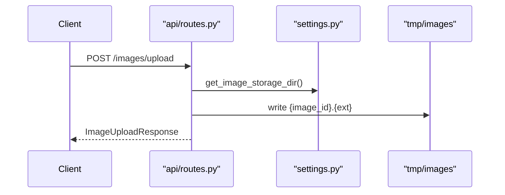
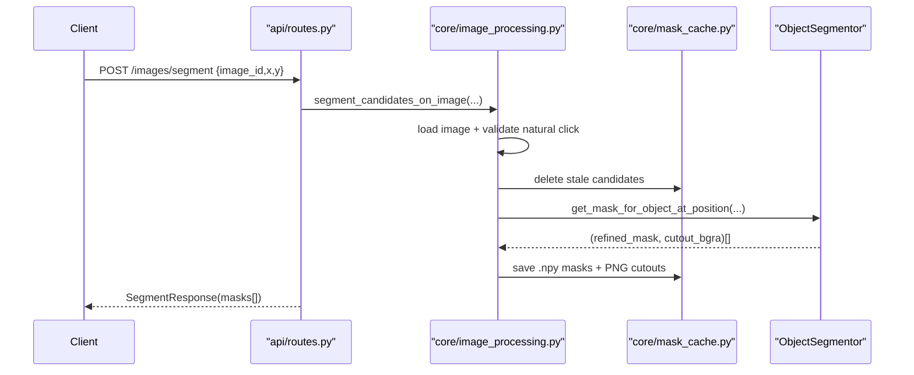
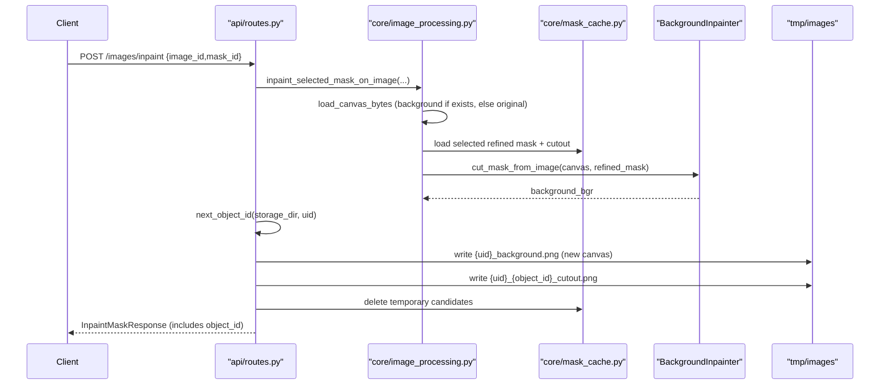

# Backend Request Lifecycle

Three image flows go through `fastApi-app/api/routes.py`.

## Upload Flow

## Segment Flow

## Inpaint Flow

## Cache Rules

- Candidate cache exists only between segmentation response and user selection.
- New segmentation for same image deletes older candidates first.
- Segmentation reads from the current canvas (`{uid}_background.png` if present, original otherwise) — each new object is cut from the already-cleaned room image.
- Successful inpaint writes the new background to `{uid}_background.png` (overwrites — becomes the canvas for the next object) and the cutout to `{uid}_{object_id}_cutout.png` (numbered — prior objects are never overwritten).
- Successful inpaint deletes every `{uid}_mask_*` temporary file.

## Synchronous Model

Endpoints remain synchronous. Segmentation returns only after all mask candidates are ready; inpainting returns only after selected background is generated. There is no queue, progress stream, or worker pool.
