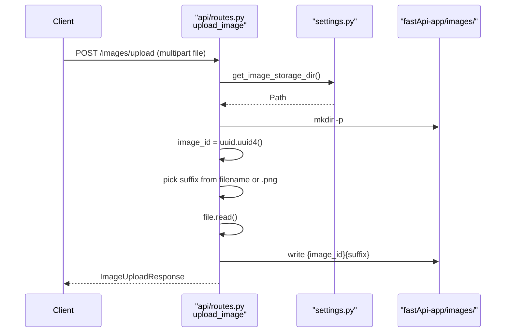
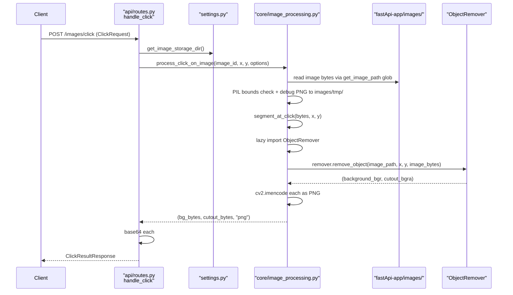

# Backend Request Lifecycle

Two endpoints, two flows. Both go through `fastApi-app/api/routes.py`.

## Upload flow

Code: [`fastApi-app/api/routes.py`](../../fastApi-app/api/routes.py) lines 24–54.

## Click flow

## Per-step file:line references

| Step | File | Lines |
|---|---|---|
| Resolve storage dir | [`fastApi-app/api/routes.py`](../../fastApi-app/api/routes.py) | 35, 66 |
| Locate file by `image_id.*` | [`fastApi-app/core/image_processing.py`](../../fastApi-app/core/image_processing.py) | 53–59 |
| Load bytes | [`fastApi-app/core/image_processing.py`](../../fastApi-app/core/image_processing.py) | 62–70 |
| PIL open + bounds check | [`fastApi-app/core/image_processing.py`](../../fastApi-app/core/image_processing.py) | 125–145 |
| Debug PNG (`tmp/{id}_debug.png`) | [`fastApi-app/core/image_processing.py`](../../fastApi-app/core/image_processing.py) | 32–50, 141 |
| Lazy import pipeline | [`fastApi-app/core/image_processing.py`](../../fastApi-app/core/image_processing.py) | 19–29 |
| Call `ObjectRemover.remove_object` | [`fastApi-app/core/image_processing.py`](../../fastApi-app/core/image_processing.py) | 89–96 |
| `cv2.imencode` PNG | [`fastApi-app/core/image_processing.py`](../../fastApi-app/core/image_processing.py) | 98–106 |
| Exception → HTTP status | [`fastApi-app/api/routes.py`](../../fastApi-app/api/routes.py) | 76–84 |
| Base64 encode | [`fastApi-app/api/routes.py`](../../fastApi-app/api/routes.py) | 86–87 |
| Build response | [`fastApi-app/api/routes.py`](../../fastApi-app/api/routes.py) | 89–94 |

## Synchronous, no concurrency

Every request blocks until `ObjectRemover.remove_object` returns. With a CPU-only setup this is many seconds. There is no queue, no worker pool, no streaming progress channel — the response only comes back after the full pipeline is done.

If you ever need parallel requests, note that the AI pipeline caches the SAM predictor, LaMa, the SD pipe and HF depth pipelines behind module-level `functools.lru_cache` factories — one shared instance of each per process. Serializing access to those (especially the SD pipeline) is left to the caller.
