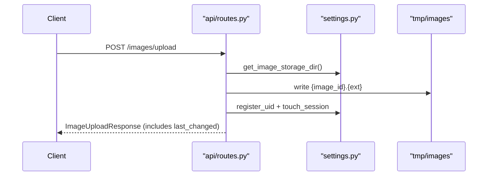
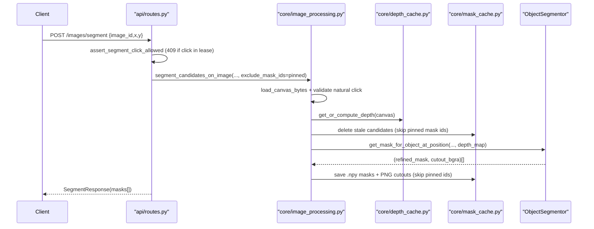
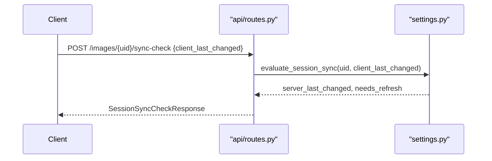
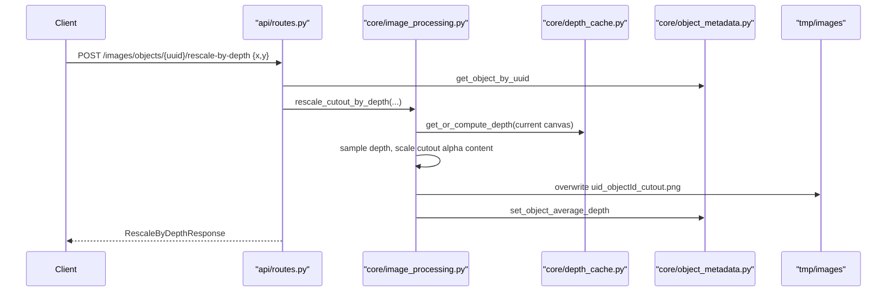

# Backend Request Lifecycle

Three image flows go through `fastApi-app/api/routes.py`.

## Upload Flow

```mermaid
sequenceDiagram
    participant Client
    participant Router as "api/routes.py"
    participant Settings as "settings.py"
    participant Disk as "tmp/images"

    Client->>Router: POST /images/upload
    Router->>Settings: get_image_storage_dir()
    Router->>Disk: write {image_id}.{ext}
    Router->>Settings: register_uid + touch_session
    Router-->>Client: ImageUploadResponse (includes last_changed)
```

## Segment Flow

```mermaid
sequenceDiagram
    participant Client
    participant Router as "api/routes.py"
    participant Core as "core/image_processing.py"
    participant Depth as "core/depth_cache.py"
    participant Cache as "core/mask_cache.py"
    participant AI as "ObjectSegmentor"

    Client->>Router: POST /images/segment {image_id,x,y}
    Router->>Router: assert_segment_click_allowed (409 if click in lease)
    Router->>Core: segment_candidates_on_image(..., exclude_mask_ids=pinned)
    Core->>Core: load_canvas_bytes + validate natural click
    Core->>Depth: get_or_compute_depth(canvas)
    Core->>Cache: delete stale candidates (skip pinned mask ids)
    Core->>AI: get_mask_for_object_at_position(..., depth_map)
    AI-->>Core: (refined_mask, cutout_bgra)[]
    Core->>Cache: save .npy masks + PNG cutouts (skip pinned ids)
    Router-->>Client: SegmentResponse(masks[])
```

## Inpaint Flow

```mermaid
sequenceDiagram
    participant Client
    participant Router as "api/routes.py"
    participant Core as "core/image_processing.py"
    participant Depth as "core/depth_cache.py"
    participant Meta as "core/object_metadata.py"
    participant Cache as "core/mask_cache.py"
    participant AI as "BackgroundInpainter"
    participant Disk as "tmp/images"

    Client->>Router: POST /images/inpaint {image_id,mask_id}
    Router->>Router: try_admit_inpaint (409 on overlap, pin mask)
    Router->>Router: acquire_canvas_writer (block; 409 on timeout)
    Router->>Core: inpaint_selected_mask_on_image(...)
    Core->>Core: load_canvas_bytes (background if exists, else original)
    Core->>Cache: load selected refined mask + cutout
    Core->>AI: cut_mask_from_image(canvas, refined_mask)
    AI-->>Core: background_bgr
    Router->>Core: build_object_metadata_for_inpaint(...)
    Core->>Depth: get_or_compute_depth + average over mask
    Core-->>Router: ObjectMetadata
    Router->>Router: next_object_id(storage_dir, uid)
    Router->>Meta: save_object_metadata
    Router->>Disk: write {uid}_background.png (new canvas)
    Router->>Disk: write {uid}_{object_id}_cutout.png
    Router->>Disk: write {uid}_{object_id}_meta.json + object_index.json
    Router->>Cache: delete_candidate(selected mask_id only)
    Router->>Settings: touch_session(uid)
    Router->>Router: drop lease, release canvas writer
    Router-->>Client: InpaintMaskResponse (object_id, object_uuid)
```

## Session sync check

Clients that cache session state locally can poll `POST /images/{uid}/sync-check` with their last known `client_last_changed` timestamp. The server compares it against `session_timestamps.json` and returns `needs_refresh=true` when the client should re-fetch objects, background, names, 3D status, or novel-view artifacts.

```mermaid
sequenceDiagram
    participant Client
    participant Router as "api/routes.py"
    participant Settings as "settings.py"

    Client->>Router: POST /images/{uid}/sync-check {client_last_changed}
    Router->>Settings: evaluate_session_sync(uid, client_last_changed)
    Settings-->>Router: server_last_changed, needs_refresh
    Router-->>Client: SessionSyncCheckResponse
```

## Rescale-by-Depth Flow

Backend-only today (no frontend caller). Persists rescaled cutout to disk.

```mermaid
sequenceDiagram
    participant Client
    participant Router as "api/routes.py"
    participant Core as "core/image_processing.py"
    participant Depth as "core/depth_cache.py"
    participant Meta as "core/object_metadata.py"
    participant Disk as "tmp/images"

    Client->>Router: POST /images/objects/{uuid}/rescale-by-depth {x,y}
    Router->>Meta: get_object_by_uuid
    Router->>Core: rescale_cutout_by_depth(...)
    Core->>Depth: get_or_compute_depth(current canvas)
    Core->>Core: sample depth, scale cutout alpha content
    Core->>Disk: overwrite uid_objectId_cutout.png
    Core->>Meta: set_object_average_depth
    Router-->>Client: RescaleByDepthResponse
```

## Cache Rules

- Candidate cache exists only between segmentation response and user selection (or until promoted by inpaint).
- New segmentation for same image deletes older candidates first, **except** mask ids pinned by active inpaint leases.
- Segmentation reads from the current canvas (`{uid}_background.png` if present, original otherwise) — each new object is cut from the already-cleaned room image.
- Successful inpaint writes the new background to `{uid}_background.png` (overwrites — becomes the canvas for the next object) and the cutout to `{uid}_{object_id}_cutout.png` (numbered — not overwritten by later inpaints).
- Rescale-by-depth overwrites `{uid}_{object_id}_cutout.png` for the targeted object and updates its metadata `average_depth`.
- Successful inpaint deletes **only** the selected `{uid}_mask_{mask_id}_*` temporary files (not all candidates).
- Depth maps (`{uid}_depth_{hash}.npy`) persist until session delete; one file per distinct canvas content hash.

## Concurrency model

Endpoints remain synchronous from the client's perspective: segmentation returns after all mask candidates are ready; inpainting returns after the selected background is generated and committed.

GPU execution may run inline or in optional worker subprocesses (`INFERENCE_WORKERS`). Same-session coordination uses a **canvas writer** (one inpaint commit at a time) and **region leases** (overlap → 409; segment allowed on non-overlapping regions during inpaint). See [concurrency.md](concurrency.md).
