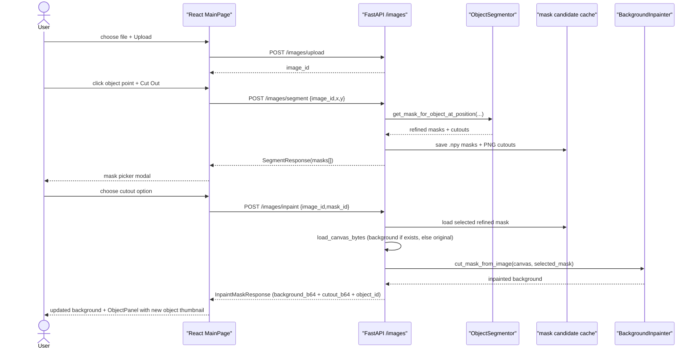

# Data Flow

Main user path is now split so mask choice remains subjective and user-controlled.

## Frontend

- `UploadFrame` converts display click into natural image pixels. When `isAddingObject` is true, it shows the latest background instead of the original upload.
- `MainPage.handleCutOut` calls `segmentImage(...)` and opens `MaskPickerModal`.
- `MaskPickerModal` shows returned cutout previews, not raw masks.
- `MainPage.handleMaskSelected` calls `inpaintMask(...)`, builds a new `CutoutObject` from the response (including `object_id`), and appends it to `objects[]`. `backgroundSrc` is updated to the new background. The active-object derived values (`cutoutSrc`, `cutoutAlphaBounds`, `glbData`) update automatically.
- `ObjectPanel` renders alongside the image frame when `objects.length > 0`. The `+` button in the panel side column enters add-object mode.

## Backend

- `POST /images/segment` validates click, runs `ObjectSegmentor`, caches each refined mask and cutout.
- `POST /images/inpaint` loads selected refined mask, runs `BackgroundInpainter`, saves final background/cutout, then deletes temporary candidates.
- `POST /images/click` remains as legacy one-step endpoint but normal UI no longer uses it.

## Storage

Runtime files under `fastApi-app/tmp/images/`:

| Pattern | Meaning |
|---|---|
| `{uid}.{ext}` | Original upload. |
| `{uid}_mask_{mask_id}_refined.npy` | Temporary selected-mask model input. |
| `{uid}_mask_{mask_id}_cutout.png` | Temporary user-facing candidate preview. |
| `{uid}_background.png` | Cumulative inpainted canvas (overwritten on each inpaint). |
| `{uid}_{object_id}_cutout.png` | Per-object cutout (numbered, never overwritten). |
| `{uid}_cutout.png` | Legacy flat cutout (sessions before per-object numbering). |
