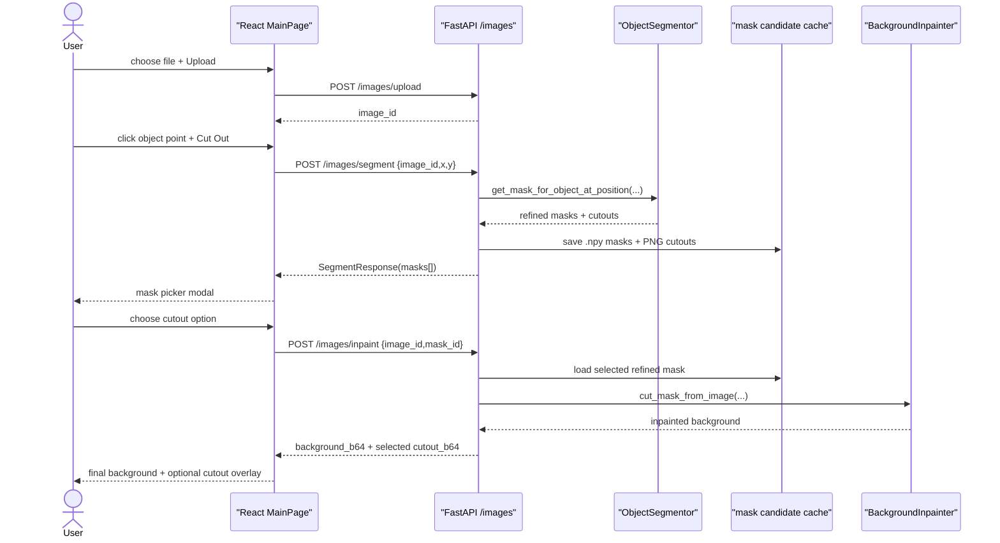

# Data Flow

Main user path is now split so mask choice remains subjective and user-controlled.

## Frontend

- `UploadFrame` still converts display click into natural image pixels.
- `MainPage.handleCutOut` calls `segmentImage(...)` and opens `MaskPickerModal`.
- `MaskPickerModal` shows returned cutout previews, not raw masks.
- `MainPage.handleMaskSelected` calls `inpaintMask(...)` and reuses existing final result state: `backgroundSrc`, `cutoutSrc`, and `cutoutAlphaBounds`.

## Backend

- `POST /images/segment` validates click, runs `ObjectSegmentor`, caches each refined mask and cutout.
- `POST /images/inpaint` loads selected refined mask, runs `BackgroundInpainter`, saves final background/cutout, then deletes temporary candidates.
- `POST /images/click` remains as legacy one-step endpoint but normal UI no longer uses it.

## Storage

Runtime files under `fastApi-app/tmp/images/`:

| Pattern | Meaning |
|---|---|
| `{uid}.{ext}` | Original upload. |
| `{uid}_mask_{mask_id}_refined.npy` | Temporary selected-mask model input. |
| `{uid}_mask_{mask_id}_cutout.png` | Temporary user-facing candidate preview. |
| `{uid}_background.png` | Final inpainted background. |
| `{uid}_cutout.png` | Final selected cutout. |
