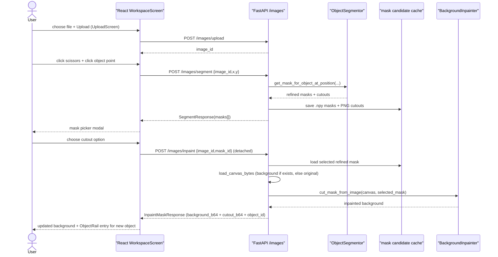

# Data Flow

Main user path is now split so mask choice remains subjective and user-controlled.

```mermaid
sequenceDiagram
    actor User
    participant UI as "React WorkspaceScreen"
    participant API as "FastAPI /images"
    participant Segmentor as "ObjectSegmentor"
    participant Cache as "mask candidate cache"
    participant Inpainter as "BackgroundInpainter"

    User->>UI: choose file + Upload (UploadScreen)
    UI->>API: POST /images/upload
    API-->>UI: image_id

    User->>UI: click scissors + click object point
    UI->>API: POST /images/segment {image_id,x,y}
    API->>Segmentor: get_mask_for_object_at_position(...)
    Segmentor-->>API: refined masks + cutouts
    API->>Cache: save .npy masks + PNG cutouts
    API-->>UI: SegmentResponse(masks[])

    UI-->>User: mask picker modal
    User->>UI: choose cutout option
    UI->>API: POST /images/inpaint {image_id,mask_id}  (detached)
    API->>Cache: load selected refined mask
    API->>API: load_canvas_bytes (background if exists, else original)
    API->>Inpainter: cut_mask_from_image(canvas, selected_mask)
    Inpainter-->>API: inpainted background
    API-->>UI: InpaintMaskResponse (background_b64 + cutout_b64 + object_id)
    UI-->>User: updated background + ObjectRail entry for new object
```

## Frontend

- `UploadScreen` handles file intake only (drag-drop or picker, client-side type/size check, `POST /images/upload`); it hands off to `WorkspaceScreen` via `App.tsx`'s route state once the image_id comes back.
- `WorkspaceScreen.handleCut` arms `cutMode`; the next click on the stage becomes the segmentation seed and calls `useSessionJobs.runSegment(...)`, which opens `MaskPickerModal`.
- `MaskPickerModal` shows returned cutout previews, not raw masks.
- `useSessionJobs.selectMask` closes the picker immediately, fires `inpaintMask(...)` detached, and on response builds a new `CutoutObject` (including `object_id`) and appends it to `objects[]`. `backgroundSrc` updates to the new background, guarded against out-of-order delivery by `highestCommittedObjectIdRef`. See [frontend/state-and-types.md](frontend/state-and-types.md).
- `ObjectRail` renders every object for the session as a right-edge slide-out panel, with a spine of per-object notches always visible.

## Backend

- `POST /images/segment` validates click, runs `ObjectSegmentor`, caches each refined mask and cutout.
- `POST /images/inpaint` loads selected refined mask, runs `BackgroundInpainter`, saves final background/cutout, then deletes temporary candidates.
- `POST /images/click` remains as legacy one-step endpoint but normal UI no longer uses it.

## Storage

Runtime files under `fastApi-app/tmp/images/`:

| Pattern | Meaning |
|---|---|
| `{uid}.{ext}` | Original upload. |
| `{uid}_mask_{mask_id}_refined.npy` | Temporary selected-mask model input. |
| `{uid}_mask_{mask_id}_cutout.png` | Temporary user-facing candidate preview. |
| `{uid}_background.png` | Cumulative inpainted canvas (overwritten on each inpaint). |
| `{uid}_{object_id}_cutout.png` | Per-object cutout (numbered, never overwritten). |
| `{uid}_cutout.png` | Legacy flat cutout (sessions before per-object numbering). |
