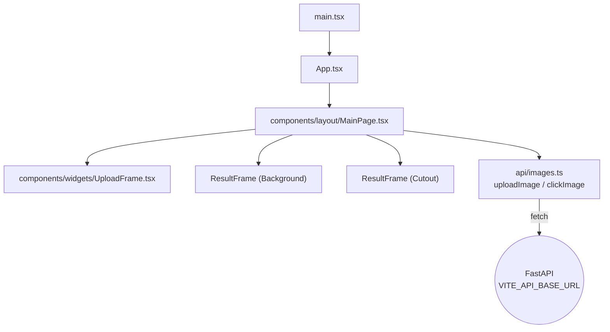

# Frontend Docs

The frontend is a React 19 + Vite 5 single-route SPA in [`react-front/`](../../react-front/). It has no router, no global state, no styling framework, and no HTTP library — just `fetch`, local `useState`, a single global `style.css`, and Three.js for GLB rendering.

## Pages

- [overview.md](overview.md) — bootstrap and tooling.
- [components.md](components.md) — `MainPage`, `UploadFrame`, `ResultFrame`.
- [api-integration.md](api-integration.md) — how the SPA talks to the FastAPI backend.
- [state-and-types.md](state-and-types.md) — local state model and TypeScript types.
- [styling.md](styling.md) — the global CSS approach.
- [user-flow.md](user-flow.md) — pick → upload → click → run, end to end.

## At a glance

