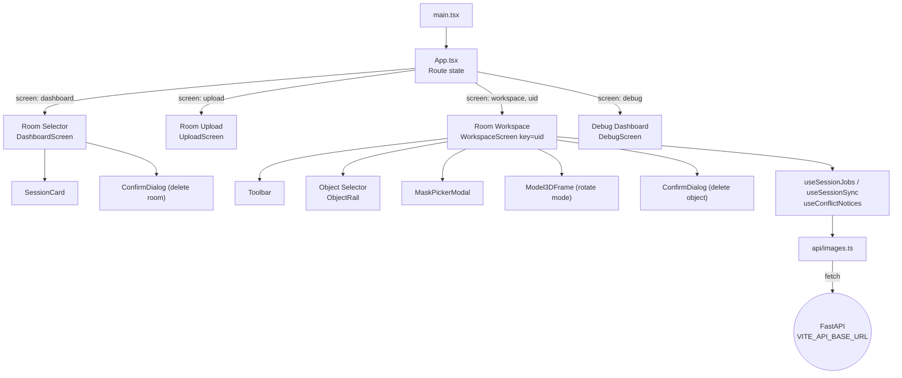

# Frontend Docs

The frontend is a React 19 + Vite 5 SPA in [`react-front/`](../../react-front/). It has no router library, no global state library, no CSS framework, and no HTTP library — just `fetch`, a handful of custom hooks, a single global `style.css`, and Three.js for 3D-render viewing.

There is no server-rendered routing: [`App.tsx`](../../react-front/src/App.tsx) switches between screens with local component state. **Room Selector** (`DashboardScreen`) is home (room list, new-room entry, room delete); **Room Upload** (`UploadScreen`) is the file-intake step; **Room Workspace** (`WorkspaceScreen`) is the editor; **Debug Dashboard** (`DebugScreen`) is the inspection screen. Product language: [`CONTEXT.md`](../../CONTEXT.md).

## Pages

- [overview.md](overview.md) — bootstrap, tooling, file layout, routing.
- [components.md](components.md) — `DashboardScreen`, `UploadScreen`, `WorkspaceScreen`, `Toolbar`, `ObjectRail`, `SessionCard`, and the shared widgets.
- [api-integration.md](api-integration.md) — how the SPA talks to the FastAPI backend.
- [state-and-types.md](state-and-types.md) — the three session hooks and the TypeScript type layers.
- [styling.md](styling.md) — design tokens and the global CSS approach.
- [user-flow.md](user-flow.md) — Room Selector → Room Upload → Room Workspace, and every in-workspace flow (cut out, drag, copy, delete, rotate, room restore/sync).

## At a glance

```mermaid
flowchart TD
    main["main.tsx"] --> App["App.tsx<br/>Route state"]
    App -->|screen: dashboard| Dashboard["Room Selector<br/>DashboardScreen"]
    App -->|screen: upload| Upload["Room Upload<br/>UploadScreen"]
    App -->|screen: workspace, uid| Workspace["Room Workspace<br/>WorkspaceScreen key=uid"]
    App -->|screen: debug| Debug["Debug Dashboard<br/>DebugScreen"]
    Dashboard --> SessionCard["SessionCard"]
    Dashboard --> ConfirmDialogD["ConfirmDialog (delete room)"]
    Workspace --> Toolbar["Toolbar"]
    Workspace --> ObjectRail["Object Selector<br/>ObjectRail"]
    Workspace --> MaskPickerModal["MaskPickerModal"]
    Workspace --> Model3DFrame["Model3DFrame (rotate mode)"]
    Workspace --> ConfirmDialogO["ConfirmDialog (delete object)"]
    Workspace --> hooks["useSessionJobs / useSessionSync<br/>useConflictNotices"]
    hooks --> apiImages["api/images.ts"]
    apiImages -->|fetch| Backend(("FastAPI<br/>VITE_API_BASE_URL"))
```
