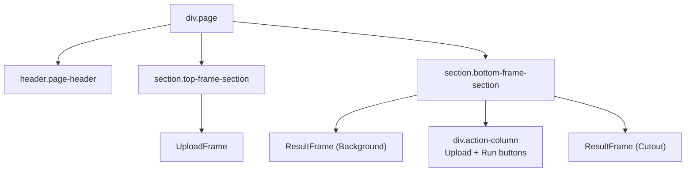

# Components

There are three real components, all functional with hooks.

## `MainPage`

[`react-front/src/components/layout/MainPage.tsx`](../../react-front/src/components/layout/MainPage.tsx)

The screen-level orchestrator. Owns all state, all callbacks, and renders one `UploadFrame` plus two `ResultFrame`s (Background and Cutout) plus action buttons.

**Responsibilities:**

- Hold the picked file, the preview object URL, the `image_id` from the backend, the click positions (display + natural), and the result data URLs.
- Talk to the backend via `uploadImage` / `clickImage` from [`api/images.ts`](../../react-front/src/api/images.ts).
- Track loading flags (`isUploading`, `isProcessing`) and show error text under the buttons.
- Revoke object URLs on unmount and on file replacement to avoid leaks.

**Render tree:**



**Buttons:**

- **Upload** — disabled if `isUploading || !uploadedFile`. On click runs `handleUpload`.
- **Run** — disabled if `isProcessing || !imageId || !clickPosition`. On click runs `handleRun`.

See [user-flow.md](user-flow.md) for what each callback does.

## `UploadFrame`

[`react-front/src/components/widgets/UploadFrame.tsx`](../../react-front/src/components/widgets/UploadFrame.tsx)

The upload widget. Two visual modes:

1. **Empty** — a placeholder button with an upload icon. Clicking it (or pressing Enter) opens the hidden `<input type="file">`.
2. **Filled** — shows the image and overlays a red dot at the last click position.

**Props:**

| Prop | Type | Notes |
|---|---|---|
| `imageSrc` | `string \| null` | Object URL produced by `MainPage`. |
| `clickPosition` | `{ x: number; y: number } \| null` | Display-space dot location. |
| `onFileSelected` | `(file: File) => void` | Called when the user picks a file. |
| `onImageClick` | `(displayPos, naturalPos) => void` | Called when the user clicks the image. |
| `disabled` | `boolean` | Disables both file picking and click capture. |

**Coordinate math:**

```43:62:react-front/src/components/widgets/UploadFrame.tsx
    const rect = event.currentTarget.getBoundingClientRect();
    const x = event.clientX - rect.left;
    const y = event.clientY - rect.top;
    
    const img = imageRef.current;
    if (img) {
      const imgRect = img.getBoundingClientRect();
      const clickXOnImg = event.clientX - imgRect.left;
      const clickYOnImg = event.clientY - imgRect.top;
      
      const naturalPos = {
        x: Math.round((clickXOnImg / imgRect.width) * img.naturalWidth),
        y: Math.round((clickYOnImg / imgRect.height) * img.naturalHeight),
      };
      
      onImageClick({ x, y }, naturalPos);
    } else {
      onImageClick({ x, y }, { x, y });
    }
```

The container click handler emits **both** positions:

- **Display position** — for the visual dot overlay (CSS `left` / `top` in container pixels).
- **Natural position** — `clickXOnImg / imgRect.width * img.naturalWidth` (and same for Y), rounded to integers — this is what gets sent to the backend so segmentation works in real image pixels regardless of how the image is rendered.

If `imageRef` is somehow null, the natural position falls back to display position.

## `ResultFrame`

[`react-front/src/components/widgets/ResultFrame.tsx`](../../react-front/src/components/widgets/ResultFrame.tsx)

A passive display component. Title at the top, then either an `` if `imageSrc` is non-null, or a placeholder.

```1:20:react-front/src/components/widgets/ResultFrame.tsx
import React from "react";

export interface ResultFrameProps {
  title: string;
  imageSrc?: string | null;
}

export const ResultFrame: React.FC<ResultFrameProps> = ({ title, imageSrc }) => {
  return (
    <div className="frame result-frame">
      <div className="frame-title">{title}</div>
      {imageSrc ? (
        
      ) : (
        <div className="frame-placeholder">Result will appear here</div>
      )}
    </div>
  );
};
```

`MainPage` renders two of these, one for Background and one for Cutout, fed by data URLs assembled from the base64 fields of `ClickResultResponse`.
