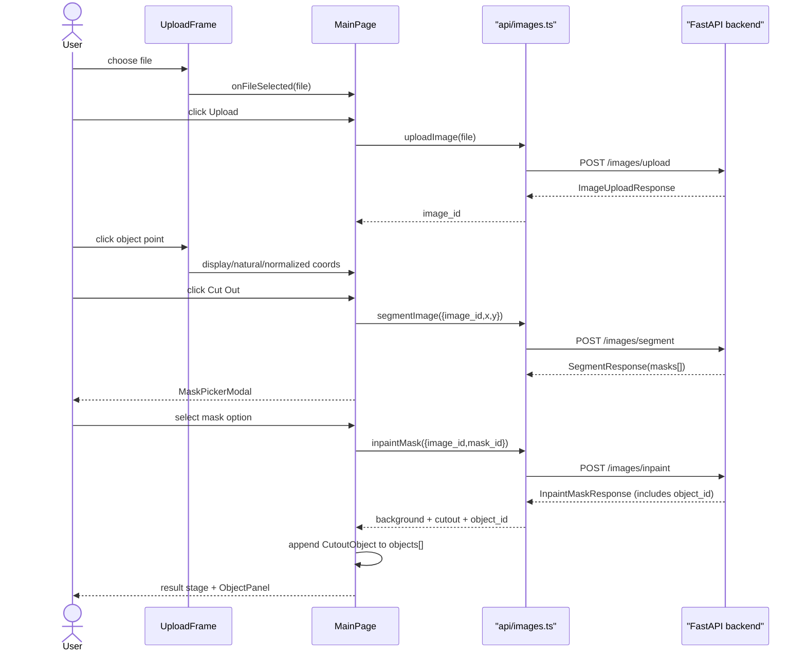

# User Flow

Primary flow: pick image → upload → click object → segment → choose mask → inpaint → optional cutout overlay.

## Mask Picker

- Modal appears over current UI after segmentation completes.
- Cards show cutout images with original object pixels and transparent background.
- Clicking card starts inpainting.
- Modal cannot close while inpainting is running because backend may remove temporary candidate files after selection.

## Drag Sequence

Drag behavior is unchanged after inpaint: cutout offset lives in natural image pixels, pointer delta converts through rendered background rect, and `cutout_bounds` clamps visible object inside frame.

## Multiple Objects

After the first inpaint completes, `ObjectPanel` appears on the right of the image frame.

1. User clicks `+` (always visible in the panel's side column) — `isAddingObject` becomes `true`.
2. `UploadFrame` reappears, this time showing the latest inpainted background rather than the original upload.
3. User clicks a new point, runs Cut Out, and chooses a mask — the same segment → inpaint sequence runs, but the backend now segments and inpaints from the current canvas.
4. New `CutoutObject` is appended to `objects[]`; `activeObjectId` points to it; `backgroundSrc` updates to the new background.
5. User can switch between objects by clicking thumbnails in `ObjectPanel`. The image frame always shows the latest background; only the cutout/3D overlays swap to reflect the selected object.

## Session Restore

Session restore calls `GET /images/{uid}/cache` for background existence and session name, then `GET /images/{uid}/objects` (via `getSessionObjects`) to load the full `objects[]` array. If objects exist, the last one becomes `activeObjectId` and `showCutout` is set to `true`. Temporary mask candidates are not restored.
