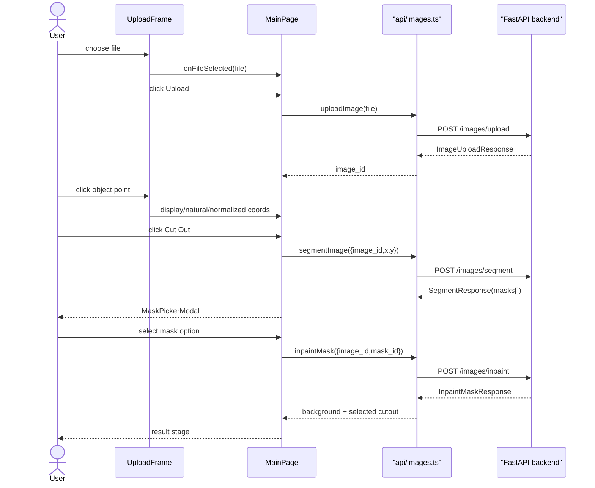

# User Flow

Primary flow: pick image → upload → click object → segment → choose mask → inpaint → optional cutout overlay.

## Mask Picker

- Modal appears over current UI after segmentation completes.
- Cards show cutout images with original object pixels and transparent background.
- Clicking card starts inpainting.
- Modal cannot close while inpainting is running because backend may remove temporary candidate files after selection.

## Drag Sequence

Drag behavior is unchanged after inpaint: cutout offset lives in natural image pixels, pointer delta converts through rendered background rect, and `cutout_bounds` clamps visible object inside frame.

## Session Restore

Restored sessions still load final `/images/{uid}/background`, `/images/{uid}/cutout`, and bounds from `/images/{uid}/cache`. They do not restore temporary mask candidates.
