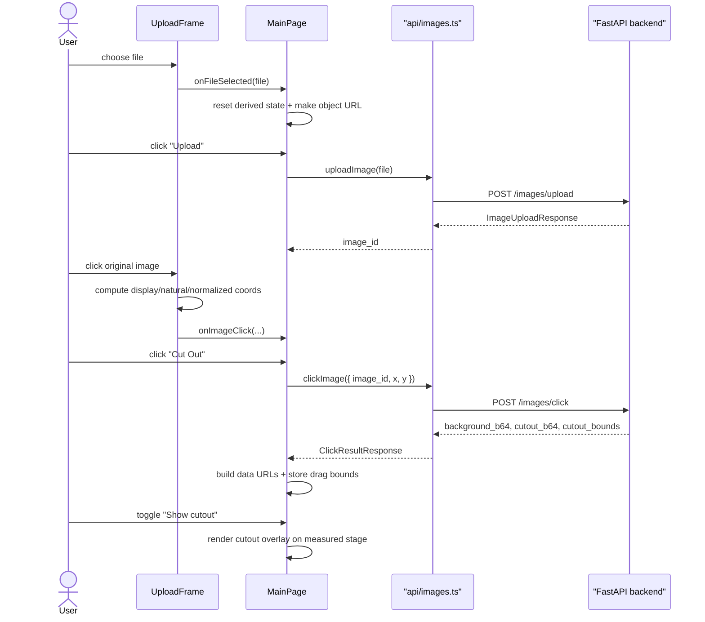
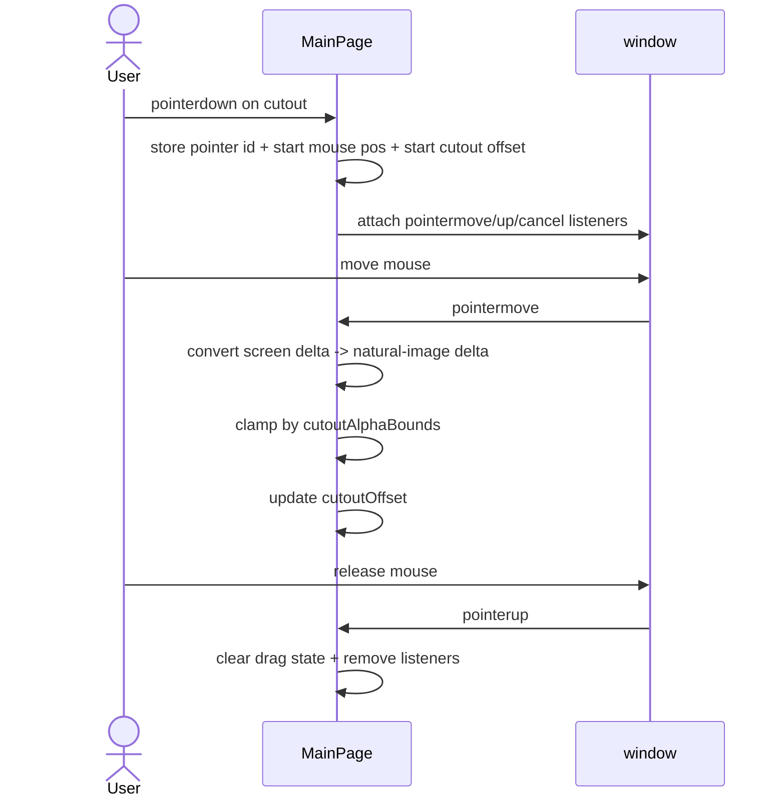

# User Flow

This document covers both original upload/cutout flow and new cutout-drag flow.

## Primary sequence

## Drag sequence

## Non-trivial flow details

### 1. Display click and drag use different coordinate systems

- `UploadFrame` click selection sends natural image pixels to backend segmentation.
- Dragging later also stores movement in natural image pixels.
- Rendering converts that natural offset back into CSS pixels each frame.

Reason: if offset lived in CSS pixels, the cutout would drift when stage size changes.

### 2. `object-fit: contain` creates hidden margins

Background image does not necessarily fill the whole frame. It may be letterboxed horizontally or vertically.

`MainPage` therefore computes `renderedBackgroundRect` from:

- `resultStageSize`
- `backgroundNaturalSize`

Both cutout and 3D overlay must align to that rect, not to whole frame.

### 3. Window listeners instead of image-local listeners

Drag listeners live on `window` while drag is active.

Reason:

- pointer can leave overlay while user is still dragging
- image-local move events become unreliable at edges
- global listeners keep drag continuous

### 4. Session restore now carries drag metadata

`GET /images/{uid}/cache` now returns `cutout_bounds`.

Reason:

- old sessions already have PNG files on disk
- frontend should not need to re-run `POST /images/click`
- restored cutouts need same drag clamp quality as fresh ones

## UI edge cases

- Cutout hidden: drag state is cleared.
- Background size unknown: cutout renders only after background `onLoad` gives natural dimensions.
- Missing `cutout_bounds`: clamp falls back to full image.
- Pointer cancel: same cleanup path as pointer up.
- Replacing upload/session: drag state and cutout offset reset to zero.
