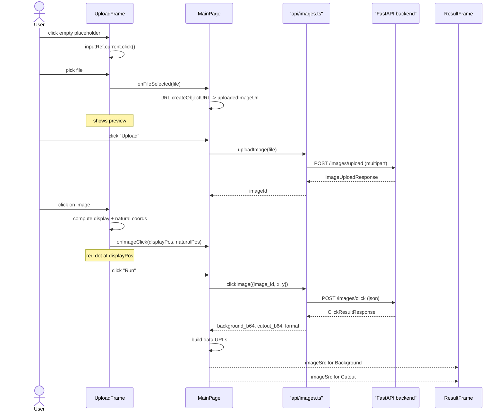

# User Flow

End-to-end interaction from the user's point of view, with the file:line references that drive each step.

## Sequence

## Step references

| Step | Code |
|---|---|
| Hidden `<input type="file">` opens picker on placeholder click | [`UploadFrame.tsx`](../../react-front/src/components/widgets/UploadFrame.tsx) lines 30–41 |
| File picked → `onFileSelected` | [`UploadFrame.tsx`](../../react-front/src/components/widgets/UploadFrame.tsx) lines 22–28 |
| `MainPage.handleFileSelected` resets state, makes object URL | [`MainPage.tsx`](../../react-front/src/components/layout/MainPage.tsx) lines 34–51 |
| `URL.createObjectURL` cleanup on unmount | [`MainPage.tsx`](../../react-front/src/components/layout/MainPage.tsx) lines 26–32 |
| Upload button → `handleUpload` → `uploadImage` | [`MainPage.tsx`](../../react-front/src/components/layout/MainPage.tsx) lines 58–77, [`api/images.ts`](../../react-front/src/api/images.ts) lines 15–25 |
| Click on image → display + natural coords | [`UploadFrame.tsx`](../../react-front/src/components/widgets/UploadFrame.tsx) lines 30–63 |
| Run button → `handleRun` → `clickImage` | [`MainPage.tsx`](../../react-front/src/components/layout/MainPage.tsx) lines 79–111, [`api/images.ts`](../../react-front/src/api/images.ts) lines 27–37 |
| Build data URLs and set state | [`MainPage.tsx`](../../react-front/src/components/layout/MainPage.tsx) lines 99–103 |
| Render results | [`MainPage.tsx`](../../react-front/src/components/layout/MainPage.tsx) lines 135–161, [`ResultFrame.tsx`](../../react-front/src/components/widgets/ResultFrame.tsx) |

## Edge cases handled in the UI

- **Run pressed without an upload** — `handleRun` early-returns with `setError("No uploaded image to process yet.")` ([`MainPage.tsx`](../../react-front/src/components/layout/MainPage.tsx) lines 80–83).
- **Run pressed without a click** — early-returns with `setError("Please click on the image to select a point of interest.")` ([`MainPage.tsx`](../../react-front/src/components/layout/MainPage.tsx) lines 85–88).
- **Backend returns non-2xx** — `handleJsonResponse` throws with the response text; the catch block surfaces it via `setError`.
- **File replaced before re-uploading** — all derived state is cleared, including the previous `imageId`. The Run button stays disabled until a new upload completes.

## What the UI deliberately does not do

- No drag-and-drop file pick (only the `<input>`).
- No zoom / pan / crop tools.
- No multi-click / multi-region selection — one click drives one segmentation.
- No history / undo of past results.
