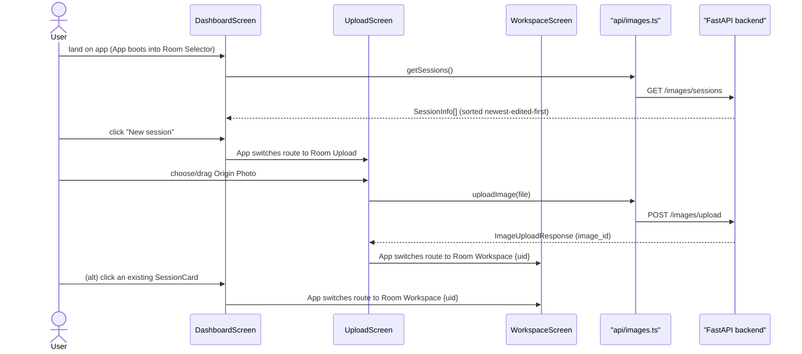
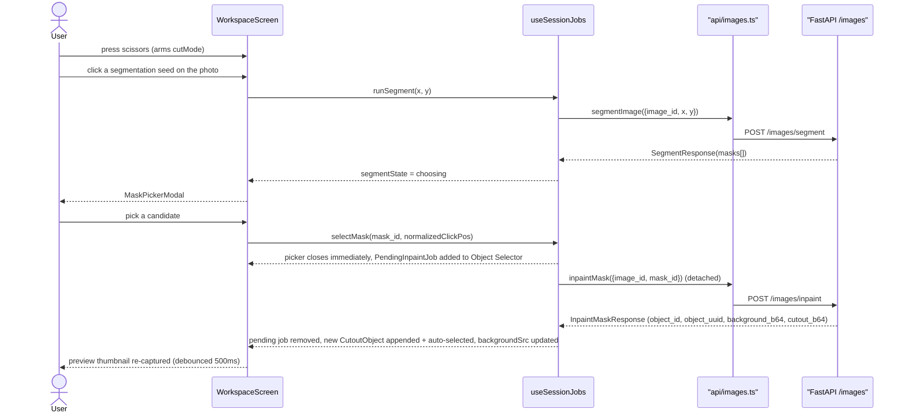
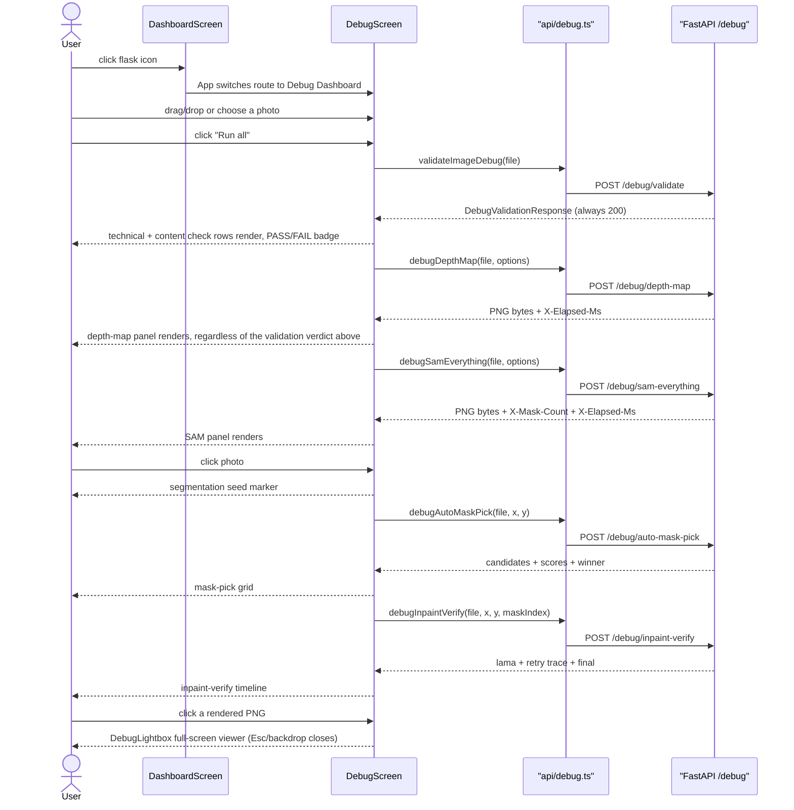

# User Flow

## Room Selector → Room Upload → Room Workspace

```mermaid
sequenceDiagram
    actor User
    participant Dash as DashboardScreen
    participant Up as UploadScreen
    participant WS as WorkspaceScreen
    participant API as "api/images.ts"
    participant Backend as "FastAPI backend"

    User->>Dash: land on app (App boots into Room Selector)
    Dash->>API: getSessions()
    API->>Backend: GET /images/sessions
    Backend-->>Dash: SessionInfo[] (sorted newest-edited-first)

    User->>Dash: click "New session"
    Dash->>Up: App switches route to Room Upload
    User->>Up: choose/drag Origin Photo
    Up->>API: uploadImage(file)
    API->>Backend: POST /images/upload
    Backend-->>Up: ImageUploadResponse (image_id)
    Up->>WS: App switches route to Room Workspace {uid}

    User->>Dash: (alt) click an existing SessionCard
    Dash->>WS: App switches route to Room Workspace {uid}
```

`WorkspaceScreen` is mounted `key={uid}`, so opening a different Room always remounts the editor from scratch rather than reusing state. The back arrow in the workspace `Toolbar` routes back to Room Selector, which re-fetches the room list.

## Segment → choose mask → inpaint

```mermaid
sequenceDiagram
    actor User
    participant WS as WorkspaceScreen
    participant Jobs as useSessionJobs
    participant API as "api/images.ts"
    participant Backend as "FastAPI /images"

    User->>WS: press scissors (arms cutMode)
    User->>WS: click a segmentation seed on the photo
    WS->>Jobs: runSegment(x, y)
    Jobs->>API: segmentImage({image_id, x, y})
    API->>Backend: POST /images/segment
    Backend-->>Jobs: SegmentResponse(masks[])
    Jobs-->>WS: segmentState = choosing
    WS-->>User: MaskPickerModal

    User->>WS: pick a candidate
    WS->>Jobs: selectMask(mask_id, normalizedClickPos)
    Jobs-->>WS: picker closes immediately, PendingInpaintJob added to Object Selector
    Jobs->>API: inpaintMask({image_id, mask_id})  (detached)
    API->>Backend: POST /images/inpaint
    Backend-->>Jobs: InpaintMaskResponse (object_id, object_uuid, background_b64, cutout_b64)
    Jobs-->>WS: pending job removed, new CutoutObject appended + auto-selected, backgroundSrc updated
    WS-->>User: preview thumbnail re-captured (debounced 500ms)
```

Because `selectMask` fires the inpaint request detached, the user can immediately click a new point and start a second segment/inpaint while the first is still running — the backend's per-session canvas-writer lock and region leases (`docs/backend/concurrency.md`) make this safe, and `useConflictNotices` surfaces any resulting 409 as a dismissible inline notice rather than a hard error.

## Batch area cut and bulk 3D

The toolbar area tool arms a box drag on the stage (always `verify=auto`). Mouse-up calls `POST /images/{uid}/batch` with `source.kind=box`. Ctrl/Cmd-click Object Selector thumbs plus the Object Selector **3D** button send `source.kind=objects`. One batch at a time on the client. Results land through `useSessionSync` after `onMutated`.

## Multiple objects, drag, copy, delete

All of a Room's objects stay composited on the inpainted Background simultaneously — each has its own `hidden` flag and drag `offset` (client-only visibility, persisted position). Selection (`selectedObjectId`) is independent of visibility and starts `null` on both fresh upload and room restore.

- **Select**: click an object's row in the Object Selector (`ObjectRail`), or click/drag it directly on the stage (alpha-precise hit-testing — see [components.md](components.md)). Hiding the selected object clears selection; a newly created object auto-selects.
- **Drag**: pointer-down on a hit object starts a drag; position updates locally on every `pointermove` (clamped to the object's visible bounds), and the final offset is persisted with one `PATCH` (`setObjectOffset`) on `pointerup` — not on every move.
- **Copy**: the toolbar's copy button (disabled without a selection, while copying, or while rotating) calls `useSessionJobs.duplicateObject`, which copies the object server-side (`POST /images/objects/{uuid}/duplicate`), fetches the Copy's full metadata, and selects it. The Copy lands nudged ~15% of its own width to one side of the source, not exactly on top of it (server-computed, see `backend/api-endpoints.md`).
- **Delete**: the toolbar's trash button opens a `ConfirmDialog`; confirming calls `useSessionJobs.deleteObject`, which requires the object to have a `uuid` (pre-UUID legacy objects can't be deleted) and permanently removes its cutout, 3D render, and novel-view caches server-side. The Background keeps the object's inpainted hole — deletion never repaints it.
- **Backtrack / Forward**: toolbar buttons (and Ctrl/Cmd+Z / Ctrl+Shift+Z / Ctrl/Cmd+Y) call `POST /images/{uid}/history/undo` and `.../redo`. Backtrack restores the previous Background stage and hides objects created after that stage; Forward brings them back. Making a new inpaint/erase after backtracking dumps the forward branch. Up to four prior stages are kept server-side.
- Both copy and delete trigger a debounced Preview re-capture (`WorkspaceScreen`'s `onMutated` wiring).

## Rotation

Pressing **Rotate** with an object selected either opens the 3D angle picker immediately (if a 3D render is already cached for that object) or first generates one (`POST /3d/test-3d`, cached via `GET /3d/{uid}/{objectId}`). While the picker is open, the selected object's 2D cutout is replaced in place by the `Model3DFrame` viewer at the same on-stage rect. Orbiting the model measures azimuth/elevation deltas from the pose it started at. Pressing Rotate again (or Enter) captures those deltas plus a capture, closes the picker, and fires `useSessionJobs.commitRotation` detached against `POST /images/novel-view` — the capture shows immediately as a placeholder and is swapped for the real synthesized image when the response lands. Escape cancels with no request. A per-object "show original" toggle in the Object Selector reverts to the Source Cutout; rotating again always restarts from that Source Cutout, since the backend never overwrites it in the rotate path.

## Room restore and background sync

On opening a Room, `WorkspaceScreen` calls `getUidCacheStatus(uid)` for the Background/name, fires `warmSessionMaps(uid)` in parallel to prefetch depth/normal caches, then `getSessionObjects(uid)` for the full object list if a cutout exists — restored objects get `hidden = false` and no `rotation`/`glbData` (those are local-only and lost across a restore). From then on, `useSessionSync` polls `POST /images/{uid}/sync-check` every 2 seconds **only while there's pending work** (an in-flight segment/inpaint/copy/etc.), plus once on window focus and tab-visibility change regardless of pending work. A stale-timestamp response triggers a merge (not a full replace) of server truth into local state, so local-only fields like `offset`, `hidden`, and `glbData` survive a reconcile untouched.

## Pipeline debug screen (Debug Dashboard)

```mermaid
sequenceDiagram
    actor User
    participant Dash as DashboardScreen
    participant Debug as DebugScreen
    participant API as "api/debug.ts"
    participant Backend as "FastAPI /debug"

    User->>Dash: click flask icon
    Dash->>Debug: App switches route to Debug Dashboard
    User->>Debug: drag/drop or choose a photo
    User->>Debug: click "Run all"

    Debug->>API: validateImageDebug(file)
    API->>Backend: POST /debug/validate
    Backend-->>Debug: DebugValidationResponse (always 200)
    Debug-->>User: technical + content check rows render, PASS/FAIL badge

    Debug->>API: debugDepthMap(file, options)
    API->>Backend: POST /debug/depth-map
    Backend-->>Debug: PNG bytes + X-Elapsed-Ms
    Debug-->>User: depth-map panel renders, regardless of the validation verdict above

    Debug->>API: debugSamEverything(file, options)
    API->>Backend: POST /debug/sam-everything
    Backend-->>Debug: PNG bytes + X-Mask-Count + X-Elapsed-Ms
    Debug-->>User: SAM panel renders

    User->>Debug: click photo
    Debug-->>User: segmentation seed marker
    Debug->>API: debugAutoMaskPick(file, x, y)
    API->>Backend: POST /debug/auto-mask-pick
    Backend-->>Debug: candidates + scores + winner
    Debug-->>User: mask-pick grid
    Debug->>API: debugInpaintVerify(file, x, y, maskIndex)
    API->>Backend: POST /debug/inpaint-verify
    Backend-->>Debug: lama + retry trace + final
    Debug-->>User: inpaint-verify timeline

    User->>Debug: click a rendered PNG
    Debug-->>User: DebugLightbox full-screen viewer (Esc/backdrop closes)
```

A separate screen reached from the Room Selector header (`App.tsx`'s `{screen:"debug"}` route), not part of Room Workspace — no `uid`, no Room created, nothing written to disk. See [components.md](components.md#debugscreen) for the panel/state breakdown and [backend/api-endpoints.md](../backend/api-endpoints.md#debug-endpoints) for the endpoints it drives.

Validation, depth, and SAM can be re-run individually or via `Run all` (sequential). Auto mask pick and inpaint verify need a click on the photo and are not included in `Run all`.

## Preview thumbnails

Every mutation that changes what a Room looks like (inpaint, rotation, rename, copy, delete, hide/show, and drag-end) triggers a debounced (500ms) client-side composite of the Background plus every visible cutout (`composeSessionPreview`), posted to `POST /images/{uid}/preview`. Room Selector's `SessionCard` reads it back via a cache-busted `GET /images/{uid}/preview` URL, falling back to a placeholder icon if the request 404s (no Preview yet — `POST /images/upload` writes an initial one server-side, so this should only happen transiently).
